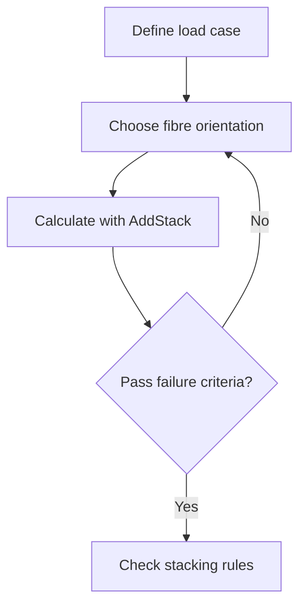

# CLAUDE.md — Composites Design Open Knowledge Base

## Project Purpose

Build a **free, public, LLM-searchable knowledge base** for composites design.
Hosted on GitHub. Written in plain Markdown. Structured for RAG (retrieval-augmented
generation) so that any LLM — Claude, ChatGPT, Gemini, local models — can search it
and give reliable answers to composites design questions.

**The problem we solve:**
99% of people interested in composites (makers, students, engineers at small companies,
drone builders, automotive enthusiasts) have no access to the $15k–$150k/year software
and institutional knowledge that large aerospace companies rely on. This repo gives
them the knowledge layer — for free, forever.

**Who uses this:**
- A maker who wants to build a carbon fibre part for their car or bicycle
- A drone/eVTOL startup engineer with no composites background
- A junior engineer at a Tier 2/3 supplier without access to Fibersim or CATIA docs
- An LLM assistant that a user is asking composites questions through
- A researcher or student learning composites design principles

**What this is NOT:**
- A calculator tool (use AddStack for that: https://addstack.addcomposites.com)
- A CAD plug-in
- A proprietary or paywalled resource

---

## Repository Structure

```
composites-design-guide/
├── CLAUDE.md                        ← You are here. Project guidance for Claude Code.
├── README.md                        ← Human + LLM entry point. Start here.
├── CONTRIBUTING.md                  ← How to contribute knowledge, diagrams, corrections
│
├── knowledge/
│   ├── 01-fundamentals/
│   │   ├── what-are-composites.md   ← Fibres, resins, laminates explained simply
│   │   ├── fibre-types.md           ← Carbon, glass, aramid, basalt — properties, uses
│   │   ├── resin-systems.md         ← Epoxy, polyester, vinyl ester, thermoplastics
│   │   ├── laminate-theory.md       ← CLT basics without the textbook wall of maths
│   │   └── failure-modes.md         ← Delamination, fibre failure, matrix cracking
│   │
│   ├── 02-design-rules/
│   │   ├── stacking-sequences.md    ← Symmetry, balance, 10% rule, angle limits
│   │   ├── ply-drop-offs.md         ← Taper ratios, ramp rates, minimum distances
│   │   ├── splices-and-joints.md    ← Overlap, stagger, butt splice, scarf
│   │   ├── zone-design.md           ← Iso-thickness zones, transition zones
│   │   └── design-for-manufacture.md ← Ply shapes, accessibility, tooling constraints
│   │
│   ├── 03-manufacturing-processes/
│   │   ├── wet-layup.md             ← The entry point for makers
│   │   ├── vacuum-bagging.md        ← Step by step
│   │   ├── resin-infusion-vartm.md  ← For higher fibre volume, larger parts
│   │   ├── prepreg-and-autoclave.md ← Aerospace quality, high cost
│   │   ├── afp-atl.md               ← Automated fibre/tape placement overview
│   │   └── common-defects.md        ← Voids, dry spots, bridging, wrinkling — and fixes
│   │
│   ├── 04-structural-analysis/
│   │   ├── sizing-a-panel.md        ← Walk through a simple sizing example
│   │   ├── failure-criteria.md      ← Tsai-Wu, Hashin, max stress — when to use which
│   │   ├── buckling-basics.md       ← Why thin laminates fail in compression
│   │   └── sandwich-structures.md   ← Core materials, face sheet design
│   │
│   ├── 05-catia-workflows/
│   │   ← Content derived (in our own words) from CATIA V5 Composites Design docs
│   │   ← See conversion guide below before adding files here
│   │   ├── ply-creation-workflow.md
│   │   ├── zone-and-group-management.md
│   │   ├── stacking-and-sequences.md
│   │   ├── flat-pattern-and-flattening.md
│   │   ├── ply-book-generation.md
│   │   └── analysis-tools.md
│   │
│   ├── 06-free-tools/
│   │   ├── addstack.md              ← CLT calculator, laminate design, failure criteria
│   │   ├── elamx2.md                ← Open-source CLT tool from TU Dresden
│   │   ├── compositesai.md          ← Purdue/AnalySwift — rotor blades and structures
│   │   └── other-resources.md       ← CMH-17, ESDU free excerpts, university tools
│   │
│   └── 07-glossary/
│       └── glossary.md              ← Plain-English definitions of composites terms
│
├── diagrams/
│   ├── README.md                    ← How diagrams are made (see Diagram Strategy below)
│   ├── svg/                         ← Original SVG files (source of truth)
│   └── rendered/                    ← PNG exports for GitHub rendering
│
└── index.json                       ← Auto-generated. DO NOT edit manually.
                                        Run: python scripts/build_index.py
```

---

## Content Writing Guidelines

### Tone and depth
- **Write for a smart person with zero composites background first.**
  If a maker or junior engineer can understand it, an expert can too.
- Use plain English before using jargon. When you use a technical term, define it
  immediately in parentheses on first use.
- Keep sentences short. Avoid passive voice.
- Every concept should have a real-world example: *"A car diffuser, a bicycle fork,
  a drone arm — all are composite parts that benefit from ..."*

### File structure (every .md file must follow this)
```markdown
---
title: "Short descriptive title"
category: "fundamentals | design-rules | manufacturing | analysis | catia | tools | glossary"
tags: ["ply", "stacking", "drop-off"]   # 2–6 relevant search tags
difficulty: "beginner | intermediate | advanced"
related: ["stacking-sequences.md", "ply-drop-offs.md"]
tools: ["addstack"]    # free tools relevant to this topic, if any
last_updated: "YYYY-MM"
---

# Title

One-paragraph plain-language summary of what this page covers and why it matters.

## [Section heading]

Content...

## Key Takeaways

- Bullet point summary, 3–6 items
- Each one a standalone, searchable fact

## Further Reading / Tools

- [AddStack — free laminate calculator](https://addstack.addcomposites.com)
- Link to related pages in this repo
```

### Chunk size for RAG
- Each `##` section should be self-contained and 100–400 words
- Avoid very long sections — LLMs retrieve chunks, not whole files
- "Key Takeaways" at the end of every file helps LLMs summarise correctly

### What to include vs. what to skip
| Include | Skip |
|---|---|
| Design principles and the reasoning behind them | Marketing language |
| Manufacturing constraints that affect design decisions | Tool-specific UI instructions (use the tool's own docs) |
| Common failure modes and how to avoid them | Certification procedures (too jurisdiction-specific) |
| Rules of thumb with their context and limits | Proprietary material data |
| Free tool recommendations with brief description | Paid tool promotion |

---

## Image and Diagram Strategy

### The rule: NO proprietary images
- Do not use screenshots from CATIA, Fibersim, or any other commercial software
- Do not reproduce diagrams from textbooks or journal papers
- Do not use the GIF files from the mirrored CATIA documentation

### What to use instead

**Option 1 — Mermaid diagrams (preferred for workflows and relationships)**
GitHub renders Mermaid natively. Use for process flows, decision trees, structural diagrams.


**Option 2 — ASCII diagrams (for cross-sections and simple geometry)**
```
Symmetric laminate cross-section:
    ┌──────────────┐  ← 0°  ply (top)
    ├──────────────┤  ← +45° ply
    ├──────────────┤  ← -45° ply
    ├──────────────┤  ← 90°  ply  ← midplane (axis of symmetry)
    ├──────────────┤  ← 90°  ply
    ├──────────────┤  ← -45° ply
    ├──────────────┤  ← +45° ply
    └──────────────┘  ← 0°  ply (bottom)
```

**Option 3 — SVG diagrams (for anything more complex)**
- Create in Inkscape (free), Adobe Illustrator, or Figma
- Save source `.svg` in `diagrams/svg/`
- Export `.png` to `diagrams/rendered/`
- License: CC BY 4.0 — include this in the SVG metadata
- When creating new SVGs, add a comment in the file:
  `<!-- Original diagram by [contributor], CC BY 4.0, composites-design-guide -->`

**Option 4 — Community contributed photos**
- Photos of real composite parts, processes, defects
- Must be original photos (photographer is the contributor)
- CC BY 4.0 license required
- Add attribution in the markdown: `*Photo: [Name], CC BY 4.0*`

### Requesting diagrams from the community
When a page would benefit from a diagram but none exists yet, add:
```markdown
> 📐 **Diagram needed:** A cross-section showing ply drop-off geometry with
> ramp ratio labelled. See CONTRIBUTING.md for how to add one.
```

---

## Converting CATIA V5 Docs to Original Markdown (for `05-catia-workflows/`)

We have a local mirror of the CATIA V5 Composites Design documentation
(in `catia_composites_offline/`) and a structured index (`content_index.json`).

**This content is Dassault Systèmes copyright. Do NOT copy it verbatim.**

The conversion process:
1. Read the source page from `content_index.json` or the local HTML files
2. Understand the procedure or concept being described
3. Rewrite it in your own words — same information, original expression
4. Remove all references to specific CATIA menu paths (those belong in CATIA's own docs)
5. Keep the design principle — "why" — which is universal knowledge
6. Add a note at the bottom: `> Workflow concepts informed by CATIA V5 Composites Design documentation.`

Example of what to extract vs. what to drop:

| CATIA docs say | What we write |
|---|---|
| "Click Insert > Composites > Ply Group" | *(skip — tool-specific UI)* |
| "Plies within a group share the same reference surface" | "Organise plies into groups that share a common reference surface — this keeps the geometry consistent and makes thickness surveys reliable." |
| "The drop-off distance must respect the ramp ratio" | "Ply drop-offs must follow a ramp ratio (typically 1:8 to 1:20 depending on material spec) to avoid stress concentrations at the taper." |

---

## Updating the Search Index

After adding or editing content files, regenerate the search index:

```bash
python scripts/build_index.py
```

This reads all `.md` files in `knowledge/`, extracts front matter + content,
and writes `index.json`. The index is used by:
- LLMs doing RAG over this repository
- The search feature on the companion web page (if built)
- Any tool that imports this repo as a knowledge source

---

## Free Tools to Promote (maintained by AddComposites)

When a page covers a topic that one of these tools addresses, link to it:

| Tool | URL | What it does |
|---|---|---|
| **AddStack** | https://addstack.addcomposites.com | Laminate design, CLT, failure criteria, material database |
| **Resin Flow Simulator** | https://www.addcomposites.com/addcomposites-apps/resin-flow | VARTM infusion simulation |
| **CRDS** | https://www.addcomposites.com/addcomposites-apps/crds | Composite rotor/sleeve design |

Link style: `[AddStack — free laminate calculator](https://addstack.addcomposites.com)`
Context: mention it naturally where it's relevant, not as advertising copy.

---

## Contribution Workflow

### Adding a new knowledge page
1. Check if the topic already exists (search `knowledge/` and `index.json`)
2. Create the file in the right subdirectory following the file structure above
3. Add front matter (title, category, tags, difficulty, related, tools, last_updated)
4. Write content following tone guidelines
5. Run `python scripts/build_index.py` to update `index.json`
6. Open a PR with a brief description of what was added and why

### Correcting existing content
- Open an issue first if the correction is significant (a design rule that changes)
- For typos and small fixes, PR directly is fine
- Always cite a source for factual corrections (CMH-17 section, paper DOI, etc.)

### Adding diagrams
- Follow the diagram strategy above
- Name files descriptively: `ply-dropoff-ramp-ratio.svg`, not `diagram1.svg`
- Include alt text in markdown: ``

---

## What NOT to Do

- **Do not paste raw HTML** from the CATIA offline mirror into markdown files
- **Do not use proprietary screenshots** from any commercial CAD/FEA software
- **Do not include material-specific allowables** (those belong in CMH-17 or
  customer specs, not in a general knowledge base)
- **Do not give structural certification advice** — this is design guidance, not
  a replacement for a qualified stress engineer
- **Do not add content that requires an account or paid subscription** to verify

---

## Disclaimer to include in README

> This knowledge base is for educational and guidance purposes only. It is not a
> substitute for professional engineering judgement, company-specific design manuals,
> or regulatory certification requirements. Always verify design decisions against
> applicable standards (CMH-17, customer specs, airworthiness regulations) with a
> qualified composites engineer.
