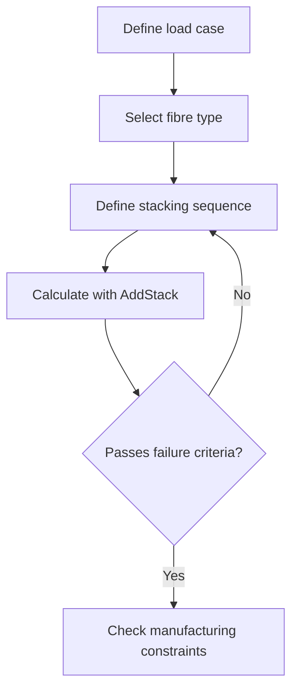

# Contributing to the Composites Design Guide

Thank you for helping build a free, open composites knowledge base. Every contribution — a paragraph of expertise, a diagram, a correction — makes this more useful for engineers and makers worldwide.

---

## Ways to Contribute

### 1. Add a new knowledge page
Pick a topic that's missing from the [knowledge base](knowledge/) and write it.
Before you start, check `index.json` or search the repo to avoid duplicates.

### 2. Improve an existing page
- Correct a factual error (please cite a source — CMH-17 section, paper DOI, etc.)
- Expand a thin section
- Improve clarity or add a real-world example
- Add "Key Takeaways" if a page is missing them

### 3. Add a diagram
Original diagrams are especially valuable. See the [Diagram Guidelines](#diagram-guidelines) below.

### 4. Add a free tool
Know a free composites tool that isn't listed? Add it to [knowledge/06-free-tools/](knowledge/06-free-tools/).

### 5. Report an error
Open a GitHub Issue with the label `factual-error`. Please include the correct information and a source.

---

## File Format (Required)

Every knowledge page **must** start with this YAML front matter:

```yaml
---
title: "Your Page Title"
category: "fundamentals | design-rules | manufacturing | analysis | catia | tools | glossary"
tags: ["tag1", "tag2", "tag3"]
difficulty: "beginner | intermediate | advanced"
related: ["other-file.md"]
tools: ["addstack"]
last_updated: "2025-02"
---
```

Then follow this structure:

```markdown
# Title

One-paragraph plain-language summary.

## Section Heading

Content (aim for 100–400 words per section).

## Key Takeaways

- Standalone, searchable fact
- Another fact
- Another fact

## Further Reading / Tools

- [AddStack](https://addstack.addcomposites.com) — if relevant
- Links to related pages in this repo
```

---

## Writing Style

- **Write for a smart non-expert first.** If a maker can understand it, an expert can too.
- Define jargon on first use: *"the fibre volume fraction (the proportion of the laminate that is fibre, not resin)"*
- Use real examples: *"A 200g/m² plain weave carbon fabric is typical for a car splitter or bicycle mudguard"*
- Keep sentences short
- Avoid marketing language and superlatives
- Do not give certification advice — this is design guidance only

---

## Diagram Guidelines

### What we accept
- **SVG files** you created yourself — best option, fully scalable
- **Mermaid diagrams** embedded in markdown — great for workflows
- **ASCII diagrams** — good for cross-sections and simple geometry
- **Your own photographs** of composite parts, processes, or defects

### What we do NOT accept
- Screenshots from CATIA, Fibersim, or any commercial software
- Diagrams copied from textbooks or papers (copyright)
- Images from the CATIA V5 documentation mirror (Dassault Systèmes copyright)

### SVG requirements
- Save source file to `diagrams/svg/your-diagram-name.svg`
- Export PNG to `diagrams/rendered/your-diagram-name.png`
- Include this comment inside the SVG file:
  `<!-- Original diagram by [Your Name], CC BY 4.0, composites-design-guide -->`
- In the markdown, use the PNG with descriptive alt text:
  ``

### Mermaid example (renders natively on GitHub)
````markdown

````

### ASCII cross-section example
```
Symmetric 8-ply laminate [0/+45/-45/90]s:

    ─────────────────  0°   ← outer ply
    ─────────────────  +45°
    ─────────────────  -45°
    ─────────────────  90°
    ════════════════   midplane (symmetry axis)
    ─────────────────  90°
    ─────────────────  -45°
    ─────────────────  +45°
    ─────────────────  0°   ← inner ply
```

---

## Requesting a Diagram

If you're writing a page that needs a diagram but you can't make one, add this
placeholder in the markdown:

```markdown
> 📐 **Diagram needed:** [Describe what the diagram should show — e.g., "A cross-section
> showing ply drop-off geometry with the ramp ratio (1:8) labelled, and the stress
> concentration at the ply termination end highlighted."]
> See [CONTRIBUTING.md](../../CONTRIBUTING.md) if you can add one.
```

---

## Pull Request Process

1. Fork the repository
2. Create a branch: `git checkout -b add/stacking-sequence-page`
3. Make your changes following the guidelines above
4. Run the index builder: `python scripts/build_index.py`
5. Commit and open a Pull Request
6. Describe briefly: what you added/changed, and why

For significant factual content, please include a reference (CMH-17 section, DOI, or a link to a credible public source).

---

## What Not to Include

- Material-specific allowables (use CMH-17 or customer specs for those)
- Certification procedures (too jurisdiction-specific; changes over time)
- Content that requires a paid subscription to verify
- Content generated purely by an LLM without expert review
- Proprietary images or screenshots

---

## Questions?

Open a GitHub Issue with the `question` label, or start a Discussion.
