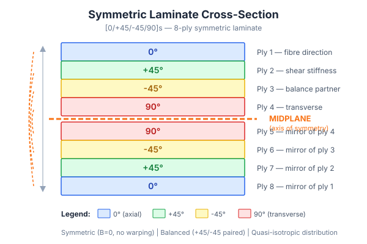

# Diagrams

Original SVG diagrams for the Composites Design Knowledge Base. All diagrams are CC BY 4.0 licensed.

## Available Diagrams

| Diagram | File | Illustrates |
|---------|------|-------------|
| Symmetric Laminate Cross-Section | `svg/symmetric-laminate-cross-section.svg` | 8-ply [0/+45/-45/90]s laminate with midplane, colour-coded angles |
| Ply Drop-Off Geometry | `svg/ply-drop-off-ramp-ratio.svg` | Taper zones, ramp ratios, drop-off rules |
| Sandwich Structure Anatomy | `svg/sandwich-structure-anatomy.svg` | Face sheets, core, adhesive layers, honeycomb pattern |
| Vacuum Bagging Setup | `svg/vacuum-bagging-setup.svg` | Full consumable stack: mould, peel ply, laminate, breather, bag |
| Resin Infusion Schematic | `svg/resin-infusion-schematic.svg` | VARTM setup with resin pot, flow mesh, vacuum pump, flow front |
| Tsai-Wu Failure Envelope | `svg/failure-envelope-tsai-wu.svg` | Stress-space failure surface with Max Stress comparison |
| Splice Types Comparison | `svg/splice-types-comparison.svg` | Butt, overlap, scarf, and staggered butt splices |
| Zone Map Example | `svg/zone-map-example.svg` | Iso-thickness zones on a panel with ply drop transitions |
| AFP Tow Placement | `svg/afp-tow-placement.svg` | Tow courses, gaps, overlaps, steering on curved surface |
| Filament Winding Patterns | `svg/filament-winding-patterns.svg` | Hoop, helical, and polar winding on cylindrical mandrels |
| Manufacturing Process Flowchart | `svg/manufacturing-process-flowchart.svg` | Decision tree: geometry > volume > quality > process |

## How to Use in Knowledge Articles

Reference diagrams in markdown files using relative paths:

```markdown

```

GitHub renders SVG files natively, so no PNG conversion is needed for web viewing.

## Creating New Diagrams

1. Use SVG format (Inkscape, Figma, or hand-coded)
2. Use the system font stack: `system-ui, -apple-system, sans-serif`
3. Include this comment at the top of each SVG:
   ```xml
   <!-- Original diagram by [contributor], CC BY 4.0, composites-design-guide -->
   ```
4. Use the project colour scheme:
   - 0° plies: Blue (#2563eb)
   - +45° plies: Green (#16a34a)
   - -45° plies: Yellow (#eab308)
   - 90° plies: Red (#dc2626)
   - Midplane/highlights: Orange (#f97316)
5. Save to `svg/` directory
6. If PNG is needed, export to `rendered/` directory

## License

All diagrams in this directory are licensed under [CC BY 4.0](https://creativecommons.org/licenses/by/4.0/).
Attribution: Composites Design Open Knowledge Base by AddComposites.
