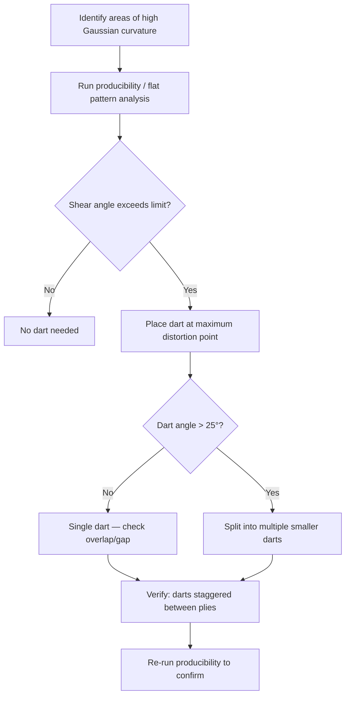

# Dart Design for Doubly Curved Surfaces

When a flat sheet of composite material must conform to a surface with double curvature (think a helmet, a wing-to-fuselage fairing, or a boat hull with compound curves), the fabric cannot lay flat without either wrinkling or bridging. A dart — a deliberate cut in the ply — relieves that excess material and lets the ply follow the surface cleanly.

## Why Darts Are Necessary

A flat sheet can wrap around a cylinder (single curvature) without distortion. But a sphere or saddle shape (double curvature) forces the material to stretch or compress in-plane. Composites do not stretch significantly, so the material wrinkles, bridges, or both. Darts solve this by removing or overlapping a wedge of material at controlled locations.

**The key metric is Gaussian curvature.** Surfaces with non-zero Gaussian curvature (positive for domes, negative for saddles) cannot be developed (flattened) without distortion. The higher the curvature, the more — and larger — darts you need.

## Dart Shapes and Types

| Dart Type | Shape | Best For |
|-----------|-------|----------|
| **Radial (pie-slice)** | V-shaped wedge radiating from a point | Dome-like surfaces, fillets |
| **Line dart** | Straight cut with overlap or gap along a line | Gentle compound curves, cylindrical transitions |
| **Curve dart** | Cut following a curved path | Complex contours, wing root fairings |
| **Combined** | Multiple small darts instead of one large one | Large panels with distributed curvature |

## Design Parameters

**Dart length** — extends from the ply edge inward toward the area of highest curvature. Longer darts relieve more material but create longer discontinuities in the fibre path. Typical range: 20–100 mm depending on part size.

**Dart angle** — the opening angle of the wedge. Wider angles remove more material. Typical range: 5°–30°. Above 30°, consider splitting into two smaller darts.

**Overlap vs gap** — at the dart edges, material can overlap (adds local thickness) or leave a gap (creates a resin-rich pocket). Industry practice:
- **Overlap darts** (3–6 mm overlap): common for hand layup and prepreg, accepted in non-primary structure
- **Gap darts** (0–3 mm gap): preferred when thickness control is critical, gap fills with resin during cure
- **Butt darts** (edges touching): ideal but difficult to achieve in practice

**Dart orientation** — align darts along the fibre direction where possible. A dart cutting across load-carrying fibres weakens the ply more than one running parallel to them.

## Darts in Different Material Forms

**Unidirectional (UD) tape:**
- Darts cut across fibres create a complete local fibre discontinuity — significant structural penalty
- Prefer darts along the fibre direction; use narrow darts (small angle) if crossing is unavoidable
- AFP/ATL machines can handle tow drops and adds as an alternative to traditional darts

**Woven fabric:**
- More forgiving because fibres in both directions carry load
- Fabric can shear to some degree before needing darts (the locking angle — typically 30°–45° for plain weave, up to 60° for satin weaves)
- Dart needed only when shear exceeds the locking angle

**Non-crimp fabric (NCF):**
- Stitching constrains draping — NCFs reach their shear limit faster than wovens
- Darts needed earlier (at lower curvature) than for equivalent woven material

## Multiple Darts on One Ply

When a single large dart would be needed (angle > 25°–30°), split it into two or more smaller darts:
- Space darts at least 25 mm apart (centre to centre)
- Stagger dart locations between adjacent plies — never stack darts through the thickness
- Alternate dart sides where possible (one dart on the left of a ply, next on the right)

```
Single large dart (avoid):        Multiple small darts (preferred):

    ╲__________╱                     ╲____╱    ╲____╱
     ╲        ╱                       ╲  ╱      ╲  ╱
      ╲  30° ╱                        ╲╱ 12°    ╲╱ 12°
       ╲    ╱
        ╲  ╱
         ╲╱
```

## Dart Placement Strategy



## Common Mistakes

- **Stacking darts through thickness** — creates a through-thickness weakness. Always stagger dart positions between plies by at least 15 mm.
- **Dart at a stress concentration** — avoid placing darts near bolt holes, ply drop-offs, or load introduction points.
- **Ignoring dart in structural analysis** — a dart is a fibre discontinuity. If in a loaded ply, account for it in FEA or apply a knockdown factor.
- **Over-darting** — using darts when fabric shear alone would suffice. Always check the shear/locking angle first.

## Key Takeaways

- Darts are needed when Gaussian curvature prevents a flat ply from conforming without wrinkling
- The locking angle of your material (30°–60° depending on weave) determines when darts become necessary
- Prefer darts aligned with the fibre direction and split large darts into smaller ones
- Always stagger dart positions between adjacent plies — never stack through thickness
- Run a flat pattern or producibility analysis to identify dart locations systematically
- A dart is a structural discontinuity — account for it in analysis

## Further Reading / Tools

- [AddStack — free laminate calculator](https://addstack.addcomposites.com) for checking laminate properties with modified plies
- [Flat Pattern and Flattening](../05-catia-workflows/flat-pattern-and-flattening.md) — producibility analysis that identifies where darts are needed
- [Common Defects](../03-manufacturing-processes/common-defects.md) — wrinkling and bridging that darts prevent
- [Design for Manufacture](design-for-manufacture.md) — broader manufacturing constraints

> Workflow concepts informed by CATIA V5 Composites Design documentation.
