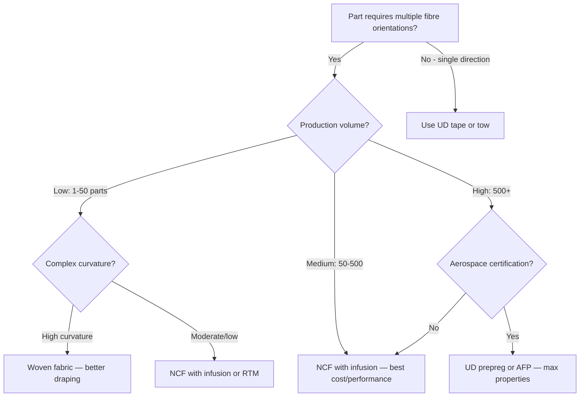

# Non-Crimp Fabrics (NCF)

Non-crimp fabrics are a distinct class of textile reinforcement where straight (uncrimped) fibre layers are stitched together rather than interlaced. This seemingly small difference has significant implications for mechanical performance, draping, and manufacturing workflow.

## What Makes NCF Different

In a woven fabric, yarns pass over and under each other — this interlacing creates "crimp" (waviness) in the fibres. Crimp reduces the effective stiffness and strength because fibres are not perfectly straight.

In an NCF, layers of straight fibres at different angles are stacked and held together by a lightweight stitching thread (typically polyester or aramid). The fibres stay straight, giving properties closer to unidirectional (UD) prepreg.

```
Woven fabric cross-section:         NCF cross-section:
   ╱╲  ╱╲  ╱╲  ╱╲                 ─────────────────  0°
  ╱──╳──╳──╳──╲                   ─────────────────  +45°
 ╱╲  ╱╲  ╱╲  ╱╲                  ═════════════════  stitching
  Fibres are wavy (crimped)        ─────────────────  -45°
                                   ─────────────────  90°
                                   Fibres stay straight
```

## NCF Constructions

| Type | Layers | Typical Angles | Common Use |
|------|--------|---------------|------------|
| **Biaxial** | 2 | 0°/90° or ±45° | Skins, shear panels |
| **Triaxial** | 3 | 0°/+45°/-45° | General structural, wind turbine blades |
| **Quadraxial** | 4 | 0°/+45°/90°/-45° | Quasi-isotropic applications, marine |

Each layer in an NCF is called a "ply" within the fabric. A single quadraxial NCF replaces four separate UD plies in the layup, dramatically reducing layup time.

## Advantages of NCF

**Higher mechanical performance than wovens:**
- No crimp means fibres carry load at their full theoretical efficiency
- Typically 10–20% better in-plane stiffness than equivalent woven
- Better fatigue performance due to straighter fibre paths

**Faster layup:**
- One NCF layer replaces 2–4 UD plies
- Reduced layup time by 50–75% compared to UD prepreg stacking
- Fewer handling operations means fewer opportunities for defects

**Infusion-friendly:**
- Open structure (inter-ply stitching creates channels) promotes resin flow
- High permeability — ideal for VARTM, RTM, and other liquid moulding processes
- Consistent fibre volume fraction across the part

**Better impact resistance:**
- Stitching provides through-thickness reinforcement
- Improved delamination resistance compared to unstitched UD laminates
- Better Compression After Impact (CAI) performance

## Disadvantages and Design Constraints

**Limited orientation freedom:**
- NCF comes in fixed angle combinations — you cannot specify arbitrary angles
- Common stock: 0°/90°, ±45°, 0°/±45°, 0°/±45°/90°
- If your design needs an unusual angle (say 30°), you cannot use standard NCF

**Stitching effects:**
- Stitch holes create local fibre distortion — small resin-rich pockets
- Stitching thread is a foreign material in the laminate
- In fatigue, stitch holes can initiate micro-cracks (though stitching also arrests delamination)

**Reduced draping capability:**
- Stitching constrains in-plane shear — NCFs reach their locking angle sooner than wovens
- Typical locking angle: 20°–35° (versus 30°–60° for woven fabrics)
- More darts needed for doubly curved surfaces
- Not suitable for tight radii without pre-forming

**Higher cost than basic wovens:**
- NCF production requires specialized knitting/stitching machinery
- Less commodity availability than plain weave glass or carbon
- Minimum order quantities can be higher

**Thickness steps:**
- Each NCF layer adds the thickness of all its sub-plies at once
- Ply drop-offs must drop an entire NCF layer — cannot drop a single sub-ply within the NCF
- This reduces design flexibility for gradual thickness transitions

## Design Implications

When designing with NCF, several rules change compared to UD prepreg:

**Stacking sequence:** The sequence within an NCF layer is fixed by the fabric manufacturer. Your design freedom is in choosing which NCF types to stack and in what order. A [0/±45/90] quadraxial NCF placed twice gives a fixed 8-ply laminate.

**Symmetry and balance:** These rules still apply, but you achieve them by selecting NCF types and stacking order carefully. A biaxial ±45° is inherently balanced. Stacking two quadraxial layers gives a symmetric quasi-isotropic laminate.

**Ply drop-offs:** You drop entire NCF layers, not individual sub-plies. Ramp ratios must account for the thicker "step" per drop.

**Splicing:** NCFs are typically available in widths of 1270 mm (50 in) to 2540 mm (100 in). For parts wider than the roll, splices are needed. Overlap splices work well with NCF because the open structure allows resin to penetrate the overlap.

## When to Choose NCF



## Key Takeaways

- NCFs provide straight-fibre mechanical properties (near UD) with faster layup than UD prepreg
- Ideal for infusion processes (VARTM, RTM) due to high permeability
- Limited to fixed angle combinations — less design flexibility than UD prepreg
- Drapes less than woven fabric — more darts needed on doubly curved surfaces
- Ply drops must occur in full NCF-layer increments, limiting taper granularity
- Best value proposition for medium-volume production with liquid moulding

## Further Reading / Tools

- [Fibre Types](../01-fundamentals/fibre-types.md) — comparison of carbon, glass, aramid fibre forms
- [Resin Infusion / VARTM](../03-manufacturing-processes/resin-infusion-vartm.md) — the process most commonly paired with NCF
- [Dart Design](dart-design.md) — NCFs need darts earlier due to lower shear limit
- [Design for Manufacture](design-for-manufacture.md) — broader manufacturing constraints

> Workflow concepts informed by CATIA V5 Composites Design documentation.
