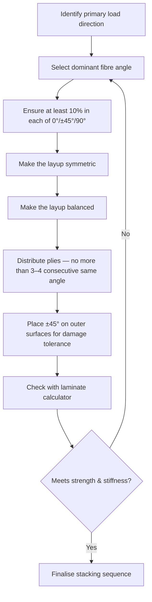

# Stacking Sequences

The stacking sequence is the recipe of a composite laminate — it defines the angle, order, and number of plies from bottom to top. Getting it right is the single most important design decision you make. A good stacking sequence gives you strength, stiffness, and stability. A bad one causes warping, premature failure, or cracks between layers.

## How to Read Stacking Notation

Engineers write stacking sequences using a compact shorthand. Understanding it is essential for reading datasheets, analysis reports, and this guide.

- **[0/90/0]** — three plies: 0°, then 90°, then 0°. Listed from bottom to top (or from the tool surface outward).
- **[0/90]s** — the subscript "s" means **symmetric**. The sequence is mirrored about the midplane: 0°, 90°, 90°, 0°. This is a 4-ply laminate.
- **[0/±45/90]s** — the "±" means both +45° and -45° are present. This expands to: 0, +45, -45, 90, 90, -45, +45, 0. An 8-ply quasi-isotropic laminate.
- **[0₂/90]** — the subscript "2" means two consecutive 0° plies. This is a 3-ply laminate: 0°, 0°, 90°.

```
Example: [0/±45/90]s expanded

    ┌──────────────┐  ply 1  →  0°
    ├──────────────┤  ply 2  →  +45°
    ├──────────────┤  ply 3  →  -45°
    ├──────────────┤  ply 4  →  90°
    ╞══════════════╡  ── midplane ──
    ├──────────────┤  ply 5  →  90°
    ├──────────────┤  ply 6  →  -45°
    ├──────────────┤  ply 7  →  +45°
    └──────────────┘  ply 8  →  0°
```

## Rule 1: Symmetry

A laminate should be **symmetric** about its midplane. This means the ply at distance *d* above the midplane has the same angle and material as the ply at distance *d* below it.

**Why it matters:** An asymmetric laminate develops internal coupling between bending and stretching. Pull on it and it also bends. Heat it and it warps. These coupling effects (called B-matrix terms in Classical Laminate Theory) cause:
- Warping after cure — the part comes off the tool twisted or curved
- Unpredictable deformations under load
- Difficulty in analysis — many simplified methods assume symmetry

**Real-world example:** A flat panel with a [0/90/45] layup (asymmetric) will curl when it cools from cure temperature. The same material as [0/90/45/45/90/0] (symmetric, written [0/90/45]s) comes out flat.

**When asymmetry is acceptable:** Some curved parts, tooling constraints, or repair patches may force asymmetry. In those cases, the designer must account for coupling in the structural analysis.

## Rule 2: Balance

A laminate is **balanced** when every +θ ply has a matching -θ ply at the same distance from the midplane. In practice, this means equal numbers of +45° and -45° plies (and equal numbers of any other off-axis pair).

**Why it matters:** An unbalanced laminate couples in-plane loads with shear. Apply a tension load and the panel also shears — it tries to parallelogram. This is almost never what you want.

Note: 0° and 90° plies don't need balancing because they don't create shear coupling.

**Practical check:** Count your +45° and -45° plies. They should be equal. Same for any +θ/-θ pair.

## Rule 3: The 10% Rule

Every laminate should have at least **10% of its plies in each of the four principal directions**: 0°, +45°, -45°, and 90°.

**Why it matters:** Even if the primary load is in one direction, a laminate needs some fibres in other directions to:
- Carry unexpected secondary loads (handling, impact, thermal expansion)
- Resist matrix cracking under combined loading
- Prevent splitting along the fibre direction
- Provide adequate bolt-bearing strength if fasteners are used

**Example:** A 20-ply laminate should have at least 2 plies each of 0°, +45°, -45°, and 90°, regardless of the primary load direction.

**When this rule bends:** Highly optimised structures (competition vehicles, space hardware) sometimes violate the 10% rule in non-critical locations. This should only be done with detailed analysis and test evidence.

## Rule 4: Limit Consecutive Plies at the Same Angle

Do not stack more than **3 to 4 consecutive plies** at the same angle.

**Why it matters:** Thick blocks of same-angle plies create:
- High interlaminar shear stress at the block boundary — the interface between a block of 0° and the adjacent ply is a weak point
- Increased risk of matrix cracking — the thick block acts almost like a single brittle layer
- Thermal micro-cracking during cure — the mismatch in thermal expansion between the block and its neighbours generates stress

**Instead of [0₆/90₂/±45₂]**, use something like **[0/45/0/-45/0/90/0/-45/0/45/0/90]** — same proportions but distributed.

## Rule 5: Protect the Outer Plies

The outermost plies (top and bottom of the laminate) deserve special attention:

- **Place ±45° plies on the outside** when impact resistance or damage tolerance matters. Off-axis plies resist crack propagation better than 0° plies.
- **Avoid placing 90° plies on the outer surface** — they are perpendicular to most handling and loading directions and are prone to surface cracking.
- **Consider a fabric (woven) ply on the outside** if surface quality, damage tolerance, or peel resistance is important. Woven plies are tougher than unidirectional ones.

**Aerospace convention:** Many aerospace design manuals require ±45° outer plies as the default, with engineering justification needed to deviate.

## Rule 6: Avoid Grouping All Same-Angle Plies Together

Distribute plies of each angle throughout the thickness, rather than grouping them. This is sometimes called the **homogeneity** or **dispersion** rule.

```
Poor (grouped):             Better (dispersed):
[0₄/+45₂/-45₂/90₂]s       [+45/0/-45/90/0/+45/0/-45/0/90]s
```

Dispersed layups improve:
- Damage tolerance — a through-thickness impact damages fewer plies of any one angle
- Interlaminar stress distribution — fewer high-shear interfaces
- Resistance to free-edge delamination

## Common Laminate Families

| Name | Typical sequence | Use case |
|---|---|---|
| Quasi-isotropic | [0/±45/90]s | General purpose, "equal in all directions" |
| 0°-dominated | [0₂/±45/90/0]s | Axially loaded beams, stringers, spar caps |
| ±45°-dominated | [±45/0/90/±45]s | Shear panels, torque tubes, fuselage skins |
| 90°-dominated | [90₂/±45/0/90]s | Hoop-loaded cylinders, pressure vessels |

## Choosing a Stacking Sequence: Practical Workflow



## Common Laminate Families

These standard layup families cover most applications. Use them as starting points, then optimise.

| Laminate Family | Notation | Use When | Typical Application |
|----------------|----------|----------|-------------------|
| **Quasi-isotropic** | [0/±45/90]ns | Equal properties in all directions needed | General-purpose panels, test coupons |
| **Hard (0°-dominated)** | [0₃/±45/90]ns | Axial stiffness or tension/compression loads dominate | Spar caps, longerons, beams |
| **Soft (±45°-dominated)** | [±45₂/0/90]ns | Shear stiffness or torsion loads dominate | Skins under shear, torsion tubes |
| **Cross-ply** | [0/90]ns | Biaxial loads, simple construction | Flat panels, student projects |
| **Angle-ply** | [±θ]ns | Pressure vessels, cylindrical shells | Filament-wound tubes, pipes |
| **Optimised** | [specific to loads] | Weight-critical structures with well-known loads | Aerospace primary structure |

**Quick rules of thumb:**
- Start with quasi-isotropic if you do not know the loads well
- Add 0° plies for bending/axial strength; add ±45° plies for shear/torsion; add 90° plies for transverse loads
- The 10% rule (minimum 10% in each direction) prevents unexpected failures from secondary loads

## Key Takeaways

- Always design symmetric laminates (mirrored about the midplane) to avoid warping
- Always design balanced laminates (equal +θ and -θ plies) to avoid shear coupling
- Keep at least 10% of plies in each of the four principal directions (0°, ±45°, 90°)
- Never stack more than 3–4 consecutive plies at the same angle
- Place ±45° plies on the outer surfaces for damage tolerance
- Distribute ply angles throughout the thickness — don't group them

## Further Reading / Tools

- [Ply Drop-offs](ply-drop-offs.md) — how to change thickness while following stacking rules
- [Zone Design](zone-design.md) — organising a structure into regions of constant layup
- [What Are Composites?](../01-fundamentals/what-are-composites.md) — the basics of plies and laminates
- [AddStack — free laminate calculator](https://addstack.addcomposites.com) — test your stacking sequences against failure criteria
