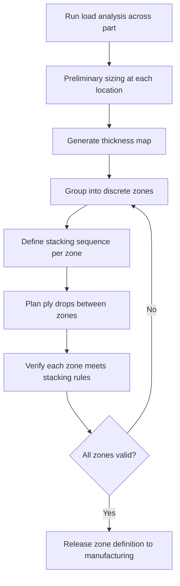

# Zone Design

A composite structure is rarely one single uniform laminate. Different areas of a part see different loads, so they need different layups. Zone design is the process of dividing a part into regions — **zones** — each with its own laminate definition (number of plies, angles, stacking sequence). It is the bridge between structural analysis ("I need this much stiffness here") and manufacturing ("I need to know which plies go where").

## What Is a Zone?

A **zone** (also called an iso-thickness zone or laminate zone) is a region of a composite part where the laminate definition is constant — same number of plies, same stacking sequence, same total thickness. Within a zone, every point on the part has the same layup.

**Real-world example:** On an aircraft wing skin, the root section near the fuselage might be Zone A with 60 plies. Halfway along the span, Zone B has 40 plies. Near the tip, Zone C has 20 plies. Each zone is sized for the loads at that location.

```
Wing skin zone map (simplified top view):

    ┌──────────┬──────────┬──────────┐
    │          │          │          │
    │  Zone A  │  Zone B  │  Zone C  │
    │  60 plies│  40 plies│  20 plies│
    │          │          │          │
    └──────────┴──────────┴──────────┘
    root                          tip
    (high load)              (low load)
```

## Transition Zones

Where two zones meet, the laminate must transition from one thickness to another. This transition region is where ply drop-offs occur (see [Ply Drop-offs](ply-drop-offs.md)). The transition zone is not a zone in itself — it is the ramp region between two zones.

```
Side view through the wing skin:

    Zone A            Transition          Zone B
    ┌────────────┐    ╲                ┌────────────┐
    │ 60 plies   │     ╲               │ 40 plies   │
    │            │      ╲              │            │
    │            │       ╲             │            │
    └────────────┘        ╲            └────────────┘
                    ← ramp region →
                    (ply drop-offs here)
```

The ramp region width is governed by the ramp ratio and the number of plies being dropped. If you drop 20 plies with a 1:20 ramp ratio and each ply is 0.13 mm thick, the ramp is:

20 plies × 0.13 mm × 20 = 52 mm wide

## How to Define Zones: The Workflow

### Step 1: Load Analysis

Start with the loads. A finite element (FE) model or hand calculation gives you the running loads (force per unit width, in N/mm) at various points across the structure. These loads vary by location.

### Step 2: Preliminary Sizing

For each location, determine the minimum number of plies needed to carry the local loads. Use Classical Laminate Theory (CLT) — tools like [AddStack](https://addstack.addcomposites.com) make this quick. You now have a "thickness map" — a continuous field showing required thickness across the part.

### Step 3: Discretise into Zones

The continuous thickness map must be turned into discrete zones, because you cannot have a different laminate at every point — it would be unmanufacturable. Group nearby areas of similar thickness into zones.

**Rules for discretisation:**
- **Minimise the number of zones** — each additional zone adds manufacturing complexity (more ply boundaries, more inspection)
- **Zone boundaries should follow natural features** — ribs, spars, stiffener lines, or panel edges make natural zone boundaries
- **Don't over-optimise** — rounding up from 38 plies to 40 plies in a zone costs a small weight penalty but greatly simplifies manufacturing
- **Ensure each zone has a valid stacking sequence** — the laminate at every zone must still satisfy symmetry, balance, and 10% rules

### Step 4: Define the Transition Strategy

Decide how plies will drop between adjacent zones. This is where [ply drop-off rules](ply-drop-offs.md) apply. Plan which specific plies continue from one zone to the next and which ones terminate.



## Zone Numbering and Ply Tables

A typical zone definition document (sometimes called a ply table or ply book) contains:

| Zone | Plies | Sequence | Thickness (mm) |
|---|---|---|---|
| A | 60 | [±45/0₂/90/±45/0/±45/0/90/…]s | 7.8 |
| B | 40 | [±45/0/90/±45/0/±45/0/90/…]s | 5.2 |
| C | 20 | [±45/0/90/±45/0/90/±45/0/90/±45] | 2.6 |

Each zone also specifies:
- Which plies are continuous (run through multiple zones)
- Which plies are dropped at each transition
- The drop-off sequence and stagger distances

## Zone Design Principles

### Keep Continuous Plies Through Multiple Zones

Some plies should run the full length of the part — typically the outer ±45° plies and a minimum set of 0° and 90° plies. These form the "backbone" of the laminate. Only the additional reinforcement plies are dropped zone to zone.

```
Ply continuity across zones:

    Zone A        Zone B        Zone C
    ±45 ──────────────────────────────── continuous (outer)
    0   ──────────────────────────────── continuous
    90  ──────────────────────────────── continuous
    0   ──────────────┐
    ±45 ──────────────┤                  dropped at A→B
    0   ──────────────┘
    ±45 ────────────────────────┐
    0   ────────────────────────┤        dropped at B→C
    90  ────────────────────────┘
    ±45 ──────────────────────────────── continuous (inner)
```

### Size Zones by Structural Features

Align zone boundaries with the structure's load-carrying features:
- **Along ribs or frames** — the rib caps act as natural barriers
- **Along stiffener lines** — load redistribution at stiffeners makes them natural thickness boundaries
- **At panel boundaries** — if the part is built from multiple panels, each panel edge is a zone boundary

### Account for Manufacturing Access

Zones must be physically producible:
- Can the layup technician or AFP machine reach the zone boundary to stop a ply?
- Is the zone large enough to be practical? Very small zones (less than 50 × 50 mm) are difficult to lay up accurately.
- Will the transition ramps interfere with adjacent features (fasteners, access panels, lightning strike protection)?

## Common Zone Design Mistakes

| Mistake | Consequence | Fix |
|---|---|---|
| Too many zones | Manufacturing cost and time explode | Consolidate zones with similar thickness |
| Zone boundaries at high-stress locations | Ply drops coincide with peak loads | Move boundaries to lower-stress regions |
| Forgetting symmetry in thinner zones | Warping after cure in outer zones | Verify stacking rules at every zone |
| Not tracking ply continuity | Loss of load path through the structure | Maintain a master ply table showing continuity |
| Ignoring transition ramp space | Ramps overlap or crowd fastener rows | Include ramp widths in the zone layout drawing |

## Key Takeaways

- Zone design divides a composite part into regions of constant laminate definition
- Each zone must independently satisfy stacking rules (symmetry, balance, 10% rule)
- Transitions between zones use ply drop-offs governed by ramp ratios and stagger rules
- Minimise the number of zones to keep manufacturing practical — round up thickness rather than creating extra zones
- Align zone boundaries with structural features (ribs, spars, stiffeners)
- Maintain a set of continuous plies that run through all zones as the structural backbone

## Further Reading / Tools

- [Ply Drop-offs](ply-drop-offs.md) — the rules governing how plies terminate between zones
- [Stacking Sequences](stacking-sequences.md) — each zone's laminate must follow these rules
- [Design for Manufacture](design-for-manufacture.md) — manufacturing constraints that influence zone layout
- [AddStack — free laminate calculator](https://addstack.addcomposites.com) — size each zone's laminate against failure criteria
