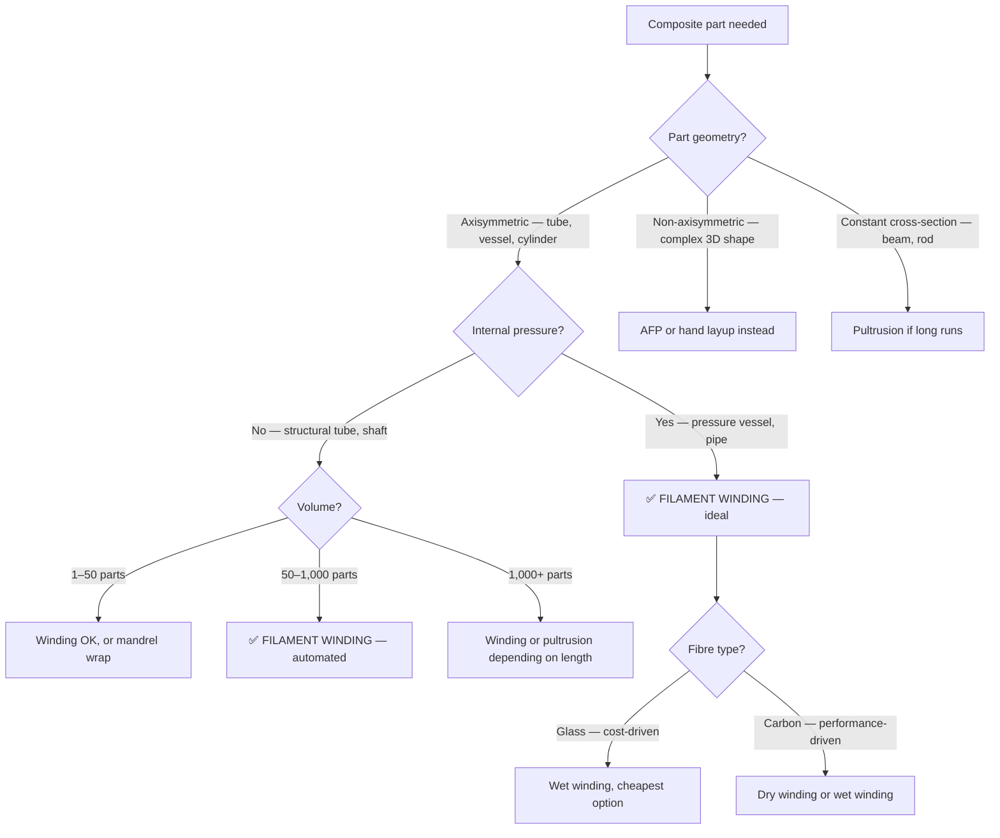

# Filament Winding

Filament winding wraps continuous fibre — either pre-impregnated (towpreg) or wet with liquid resin — around a rotating mandrel in precise, repeatable patterns. The fibres are placed under controlled tension, producing laminates with high fibre volume fractions (55–70%) and excellent repeatability. It is the dominant process for composite pressure vessels, rocket motor cases, pipes, drive shafts, and any part with a surface of revolution.

## How It Works

```
Filament winding setup (side view):

    Fibre creel / spool                    Rotating mandrel
         ┌───┐                           ┌──────────────┐
         │ ○ │──── tension ──── resin ────│ ╱╱╱╱╱╱╱╱╱╱╱╱ │ ──▶ rotation
         └───┘        ▲         bath      └──────────────┘
                      │                          ▲
                 Fibre tow               Carriage traverses
                                         along mandrel axis
```

1. **Mount the mandrel** — a rigid, removable core shaped to the part's inner surface. Materials: steel (reusable), aluminium, foam (sacrificial), or inflatable (for enclosed vessels).
2. **Thread the fibre** — continuous roving (typically 1–12 tows) passes through a tensioner, then through a resin bath (wet winding) or comes pre-impregnated (dry/towpreg winding).
3. **Wind under tension** — the mandrel rotates while a carriage translates along its axis. The ratio of rotation speed to traverse speed sets the winding angle.
4. **Build layers** — multiple passes build the laminate thickness. Each pass can use a different winding angle.
5. **Cure** — the wound part cures in an oven (thermoset resin) or consolidates under heat and pressure (thermoplastic). Room-temperature cure is possible for some epoxies.
6. **Remove mandrel** — extract the mandrel (pull-out, collapse, dissolve, or leave in place as a liner).

## Winding Patterns

The winding angle — measured from the mandrel axis — controls the laminate's mechanical properties:

| Pattern | Angle | Strength Direction | Typical Use |
|---------|-------|--------------------|-------------|
| **Hoop (circumferential)** | ~90° | Resists internal pressure (hoop stress) | Pressure vessels, pipes |
| **Helical** | 15°–75° | Biaxial loads (pressure + torsion + axial) | Rocket cases, drive shafts |
| **Low-angle helical** | 5°–15° | Axial loading | Struts, tubes under bending |
| **Polar** | ~0° (passes over poles) | Axial tension | End domes of pressure vessels |

Most pressure vessels use a combination: helical layers for combined loading plus hoop layers for burst pressure. The netting analysis gives a first estimate — for a cylindrical pressure vessel under internal pressure only, the optimal helical angle is approximately **±54.7°** (the "ideal" angle where axial and hoop stress are balanced by fibre tension alone).

```
Winding angle convention:

         Mandrel axis
         ◀──────────────────▶
              ╱╲
             ╱  ╲  ← winding angle α
            ╱ α  ╲     (from axis)
           ╱──────╲
          ╱        ╲  fibre path on
         ╱          ╲  mandrel surface
```

## Wet Winding vs Dry Winding

**Wet winding** — fibre passes through a resin bath immediately before placement.
- Lower material cost (dry fibre + liquid resin is cheaper than towpreg)
- More process variability (resin content depends on bath setup, tension, speed)
- Messier — resin dripping, pot life constraints
- Fibre volume fraction: 55–65%

**Dry winding (towpreg)** — fibre is pre-impregnated with resin (either thermoset or thermoplastic).
- Higher material cost but more consistent resin content
- Cleaner process, longer working time (no pot life for thermoset towpreg)
- Better suited for thermoplastic composites (in-situ consolidation with heat)
- Fibre volume fraction: 60–70%

## Design Considerations

### Mandrel Design
The mandrel defines your part's inner surface. Key decisions:
- **Reusable vs sacrificial** — steel/aluminium mandrels are reusable but must taper or segment for extraction. Foam, sand, or water-soluble mandrels dissolve after cure (essential for enclosed shapes like bottles).
- **Liner mandrels** — for pressure vessels, a metal or polymer liner often stays inside as the gas barrier. The composite overwrap provides structural strength.
- **Thermal expansion** — the mandrel must withstand cure temperature without distorting. CTE mismatch between mandrel and composite can cause residual stresses or mandrel seizure.

### Geodesic vs Non-Geodesic Paths
- **Geodesic paths** follow the shortest distance on the surface — the fibre naturally stays in place with zero side force. Stable, predictable, but limited to specific angles on complex shapes.
- **Non-geodesic paths** allow more design freedom (different angles on different sections) but require friction to prevent fibre slippage. Limited by the friction coefficient between wet fibre and surface (typically μ = 0.1–0.3).

### Dome and End Fitting Design
Pressure vessel domes are the hardest part. Fibre paths must navigate the dome curvature without bridging (lifting off the surface) or excessive bunching at the polar opening. The Clairaut equation governs geodesic paths on surfaces of revolution: `r × sin(α) = constant`, where `r` is the radius and `α` is the winding angle. This means the angle steepens as the radius decreases toward the pole.

## Common Defects

| Defect | Cause | Prevention |
|--------|-------|------------|
| **Fibre bridging** | Fibre lifts off concave surfaces or dome transitions | Adjust tension, use friction pins, modify dome shape |
| **Band slippage** | Insufficient friction on wet surface, non-geodesic path too aggressive | Reduce winding angle deviation from geodesic, increase surface roughness |
| **Uneven resin content** | Inconsistent resin bath level or viscosity, varying tension | Monitor bath temperature and level, calibrate tension |
| **Gaps between bands** | Bandwidth and mandrel circumference not integer-matched | Adjust pattern parameters (circuit number, dwell angle) |
| **Wrinkling at turnarounds** | Fibre bunching at dome tangent line | Optimise turnaround trajectory, reduce bandwidth |
| **Void content** | Trapped air between layers, insufficient compaction | Controlled tension, debulk between layers, proper resin degassing |

## When to Use Filament Winding

**Best suited for:**
- Axisymmetric or near-axisymmetric parts (cylinders, cones, spheres, domes)
- Pressure vessels (Type I–V hydrogen storage, CNG, COPV for aerospace)
- Pipes and ducting (oil/gas, water, chemical)
- Drive shafts and propeller shafts
- Rocket motor cases
- Flywheels and energy storage rotors
- Electric motor rotor sleeves (composite retention bands)

**Not suited for:**
- Non-axisymmetric shapes (use AFP, hand layup, or RTM instead)
- Parts requiring many ply drop-offs or local reinforcements
- Flat panels or open shapes (no mandrel to wind around)

## Comparison with AFP

| Feature | Filament Winding | AFP |
|---------|-----------------|-----|
| Part geometry | Surfaces of revolution | Any 3D surface |
| Fibre placement accuracy | ±1–2 mm (depends on bandwidth) | ±1 mm |
| Fibre volume fraction | 55–70% | 55–65% |
| Ply drop-offs and local reinforcement | Very limited | Full capability |
| Capital cost | $100k–$1M (winder) | $2–10M (traditional), much less with AFP-XS |
| Material forms | Continuous roving, tow, tape | Slit tape, tow |
| Typical production rate | Fast for suited geometries | Slower but more flexible |
| Void content achievable | <1% with good process control | <1% with autoclave |

## Cost Factors

Filament winding is one of the most cost-effective automated composites processes for suitable geometries:

- **Equipment**: CNC filament winders range from ~$100k (simple 2-axis lab winder) to ~$1M+ (multi-axis production machine with multiple spindles)
- **Material**: fibre cost dominates; glass roving is extremely cheap ($2–5/kg), carbon tow is $15–50/kg
- **Labour**: highly automated — one operator can run multiple winders
- **Tooling**: mandrel cost depends on reusability and complexity
- **Rate**: a simple pipe can be wound in minutes; a large pressure vessel in hours

## When to Choose Filament Winding



**Choose filament winding when:**
- Part is axisymmetric (tubes, pressure vessels, pipes, tanks, motor casings)
- Continuous fibre at high fibre volume fraction (55–70%) is needed
- Internal pressure loading exists (the process optimally places fibres for hoop and helical loads)
- Part can be removed from the mandrel (or mandrel becomes the liner)
- Production is moderate to high volume (highly automated process)

**Do NOT choose filament winding when:**
- Part has concave surfaces (fibre cannot follow inward curves under tension)
- Part is non-axisymmetric with complex 3D contours (use AFP instead)
- Low fibre angles (< 15° helical) are needed on small diameters (fibre slippage)

## Key Takeaways

- Filament winding wraps continuous fibre under tension around a rotating mandrel — ideal for axisymmetric composite structures
- The winding angle controls mechanical properties: hoop (~90°) for pressure, helical (15°–75°) for combined loads, polar (~0°) for axial loads
- Wet winding is cheaper but messier; dry winding (towpreg) is more consistent and cleaner
- For a cylindrical pressure vessel, the classical optimum helical angle is ±54.7°
- Fibre volume fractions of 55–70% are achievable — among the highest of any composites process
- Lower capital cost than AFP but limited to surfaces of revolution
- Design the mandrel and end fittings with as much care as the composite itself

## Further Reading / Tools

- [CRDS — Composite Rotor Design Simulator](../06-free-tools/other-resources.md) — free tool for designing composite rotors and sleeves, directly relevant to wound structures
- [CRDS →](https://www.addcomposites.com/addcomposites-apps/crds)
- [AFP and ATL](afp-atl.md) — comparison automated process for non-axisymmetric parts
- [Fibre Types](../01-fundamentals/fibre-types.md) — properties of carbon, glass, and aramid fibres used in winding
- [Resin Systems](../01-fundamentals/resin-systems.md) — epoxy, polyester, vinyl ester — choosing the right matrix for winding
- [Failure Criteria](../04-structural-analysis/failure-criteria.md) — how to check if your wound laminate meets strength requirements
- [AddStack — free laminate calculator](https://addstack.addcomposites.com) — verify laminate stiffness and strength for wound structures

> Workflow concepts informed by composites manufacturing industry practice.
