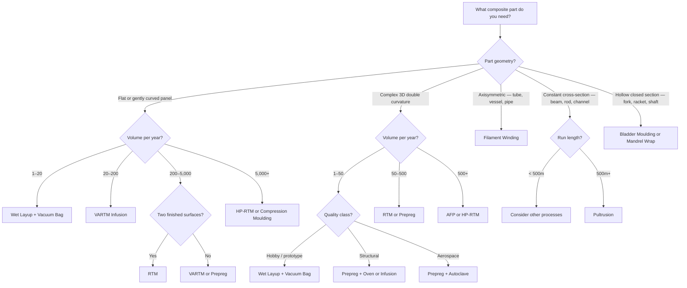

# Manufacturing Process Selection Guide

Choosing the right manufacturing process is one of the most impactful decisions in composites design. The process determines your achievable quality, cost, production rate, and which geometries are possible. This guide walks you through the selection step by step.

## The Master Decision Tree

Start here. Answer the questions to narrow down your process options.



## Process Comparison Matrix

| Process | Vf (%) | Voids (%) | Cycle Time | Tooling Cost | Part Cost at 100 units | Best Geometry |
|---------|--------|-----------|------------|-------------|----------------------|---------------|
| **Wet Layup** | 35–50 | 3–10 | Hours | $100–$2k | High (labour) | Any (small) |
| **Vacuum Bag** | 50–55 | 1–3 | Hours | $500–$5k | Moderate | Any (small-medium) |
| **VARTM** | 50–60 | 1–3 | 1–4 hrs | $1k–$20k | Moderate | Flat/curved panels |
| **RTM** | 50–60 | 0.5–2 | 15 min–2 hrs | $15k–$100k | Low-moderate | Medium complexity |
| **Prepreg + Autoclave** | 55–65 | < 1 | 2–8 hrs | $5k–$50k | High | Any |
| **Prepreg + Oven (OOA)** | 55–60 | 1–2 | 2–8 hrs | $5k–$50k | Moderate-high | Any |
| **AFP** | 55–65 | < 1 | Minutes/ply | $100k–$10M | Low (at volume) | Large, curved |
| **ATL** | 55–65 | < 1 | Minutes/ply | $500k–$5M | Low (at volume) | Large, flat |
| **Filament Winding** | 55–70 | 1–3 | Minutes–hours | $10k–$200k | Low | Axisymmetric |
| **Pultrusion** | 50–65 | 1–3 | Continuous | $10k–$80k die | Very low | Constant cross-section |

## Cost vs Volume: Where Each Process Wins

```
Cost per part ($, log scale)
    │
    │  ╲ Wet layup
    │   ╲
    │    ╲──────────────────────
    │     ╲  Vacuum bag
    │      ╲
    │       ╲─────────────────
    │   VARTM ╲
    │          ╲──────────────
    │      RTM   ╲
    │              ╲──────────
    │         Prepreg╲
    │                 ╲───────
    │            AFP    ╲
    │                    ╲────
    ├─────┬──────┬──────┬──────┬────▶
    1    10    100   1,000  10,000   Volume
```

**Key crossover points:**
- **10–50 parts:** Vacuum bagging beats wet layup on quality/cost ratio
- **50–200 parts:** VARTM beats vacuum-bagged wet layup on consistency and labour
- **100–500 parts:** RTM beats VARTM when two finished surfaces are needed
- **500–2,000 parts:** Prepreg + AFP beats hand-laid prepreg on labour cost
- **5,000+ parts:** HP-RTM or thermoplastic stamping for automotive-scale rates

## Selection by Application

| Application | Typical Process | Why |
|-------------|----------------|-----|
| **Prototype / learning** | Wet layup + vacuum bag | Cheapest entry point, learn fundamentals |
| **Drone frame** | Prepreg + oven or vacuum bag wet layup | Small parts, moderate performance |
| **Bicycle fork/frame** | Prepreg + bladder moulding | Hollow section, high performance, moderate volume |
| **Car body panel** | VARTM or RTM (1–100 parts), HP-RTM (1,000+) | Scale-dependent |
| **Boat hull** | VARTM infusion | Large, single-sided mould, moderate quality |
| **Wind turbine blade** | VARTM infusion | Very large, single-sided, high Vf needed |
| **Pressure vessel** | Filament winding | Axisymmetric, internal pressure, continuous fibre |
| **Structural I-beam** | Pultrusion | Constant cross-section, long runs |
| **Aircraft fuselage panel** | AFP + autoclave | Large, complex, aerospace quality |
| **Satellite structure** | Prepreg + autoclave | Highest quality, low volume, extreme requirements |
| **Sporting goods shaft** | Roll wrapping or filament winding | Cylindrical, moderate volume |
| **eVTOL airframe** | Prepreg + oven (prototype), AFP (production) | Quality + rate |

## Three Questions to Start

If you are unsure which process to choose, answer these three questions:

1. **What geometry?** → This eliminates most options immediately
2. **How many parts per year?** → This determines whether automation pays off
3. **What quality class?** → Hobby (Vf 35–50%), Structural (Vf 50–60%), Aerospace (Vf 55–65%, voids < 1%)

Then use the decision tree above to find your answer.

## Key Takeaways

- Part geometry is the strongest filter — axisymmetric parts go to filament winding, constant cross-sections go to pultrusion, everything else narrows from there
- Production volume determines whether automation (AFP, RTM, HP-RTM) is justified
- Quality class (hobby/structural/aerospace) determines whether prepreg+autoclave is required or if wet processes suffice
- Cost per part decreases with automation but only if volume justifies the tooling investment
- Most parts can be made by multiple processes — the choice is a trade-off between cost, quality, and rate
- When in doubt, start with the simplest process that meets your quality requirements

## Further Reading / Tools

- [Wet Layup](wet-layup.md) — the simplest starting point
- [Vacuum Bagging](vacuum-bagging.md) — the first quality upgrade
- [Resin Infusion / VARTM](resin-infusion-vartm.md) — for medium-to-large parts
- [RTM](rtm.md) — for two finished surfaces at medium volume
- [Prepreg and Autoclave](prepreg-and-autoclave.md) — for highest quality
- [AFP / ATL](afp-atl.md) — for automated high-rate production
- [Filament Winding](filament-winding.md) — for axisymmetric structures
- [Pultrusion](pultrusion.md) — for constant cross-section profiles
- [Process Costs](../08-cost-estimation/process-costs.md) — detailed cost comparison
- [AddStack — free laminate calculator](https://addstack.addcomposites.com)
