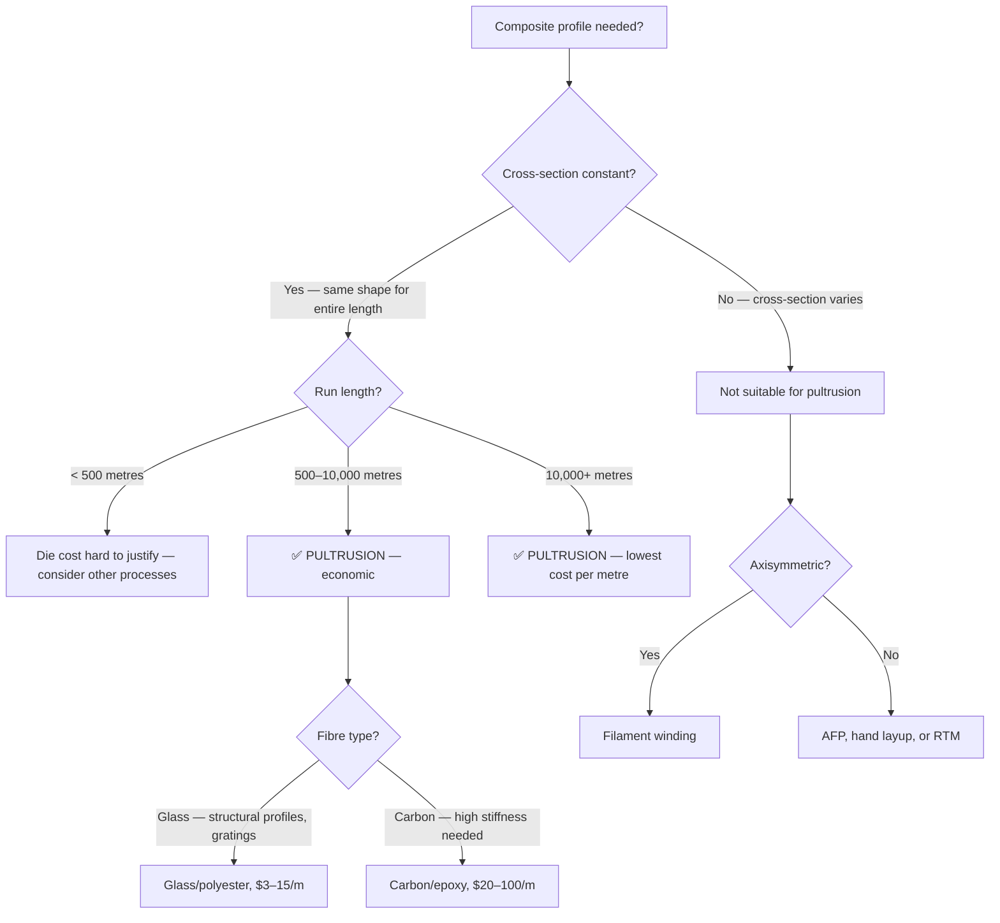

# Pultrusion

Pultrusion pulls continuous fibres through a resin bath and then through a heated die, producing composite profiles with a constant cross-section — like extrusion for metals, but pulling rather than pushing. It is the fastest, cheapest, and most automated way to make composite structural shapes: I-beams, channels, angles, tubes, rods, flat bars, and custom profiles. If your part has a constant cross-section, pultrusion is almost certainly the right process.

## How It Works

```
Pultrusion line (side view):

  Fibre creels     Resin bath       Heated die        Puller      Cut-off
  ┌─┐ ┌─┐ ┌─┐    ┌────────┐    ┌══════════════┐    ┌────┐     ┌────┐
  │○│ │○│ │○│ ──▶ │ Resin  │ ──▶│  Die cavity  │──▶ │Pull│ ──▶ │ ✂  │
  │○│ │○│ │○│    │  bath  │    │  (heated)    │    │    │     │    │
  └─┘ └─┘ └─┘    └────────┘    └══════════════┘    └────┘     └────┘
   Fibre rovings   Wet-out        Cure in die      Continuous   Cut to
   (glass, carbon) fibres         (140-200°C)      pulling      length
                                                   (0.3-3 m/min)
```

1. **Fibre supply** — continuous rovings, mats, or fabrics are pulled from creels (large spools). Glass roving is most common; carbon fibre is growing in use.
2. **Resin impregnation** — fibres pass through an open resin bath or an injection chamber (injection pultrusion). The resin wets out the fibres completely.
3. **Preforming** — guides and forming plates arrange the wetted fibres into the desired cross-section shape before entering the die.
4. **Heated die** — the die is a precision-machined steel tool heated to 140–200°C. The resin cures as it passes through, entering as liquid and exiting as a solid profile.
5. **Pulling** — a reciprocating or continuous-grip puller draws the cured profile from the die at 0.3–3 m/min (depending on wall thickness, profile size, and resin system).
6. **Cut-off** — a travelling saw cuts the continuous profile to desired lengths.

## What You Can Pultrude

```
Common pultruded cross-sections:

  ┌─────────┐    ┌─────────┐    ┌───┐    ┌─┐         ┌───────┐
  │         │    │         │    │   │    │ │         │       │
  │         │    ├─────────┤    │   │    │ │    ○    │       │
  │         │    │         │    │   │    │ │         │       │
  └─────────┘    └─────────┘    └───┘    └─┘         └───────┘
   Rectangular    I-beam        Channel   Rod        Tube
   tube / box

  ┌─────────┐    ┌─┐              ┌─────────────┐
  │         │    │ │              │ ╱         ╲ │
  └─────────┘    │ │              │╱           ╲│
                 │ │              └─────────────┘
   Flat bar      Angle (L)        Custom profile
```

**Standard profiles:** rods, tubes, flat bars, angles (L), channels (C), I-beams, H-beams, box sections, gratings, cable trays, window frames.

**Custom profiles:** any constant cross-section — T-shapes, hat sections, corrugated panels, rail profiles, bridge deck shapes, turbine blade root sections.

## Advantages Over Metals

| Property | Pultruded Composite | Steel | Aluminium |
|----------|-------------------|-------|-----------|
| Density | 1.8–2.1 g/cm3 | 7.8 g/cm3 | 2.7 g/cm3 |
| Corrosion resistance | Excellent | Requires coating | Good |
| Electrical conductivity | Insulating | Conductive | Conductive |
| Thermal conductivity | Low | High | High |
| Maintenance | Near zero | Regular painting/inspection | Moderate |
| Typical cost (glass FRP) | 1.5–3× steel by weight | Baseline | 2× steel |
| Cost by installed length | Often cheaper than steel | Baseline | Often cheaper |

Pultruded composites win on **total installed cost** for applications where corrosion resistance matters — the part costs more but lasts 3–5× longer with zero maintenance.

## Materials

**Fibres:**
- **E-Glass** — 90%+ of all pultrusion. Cheap ($2–5/kg as roving), good mechanical properties, electrically insulating. Most structural profiles, gratings, rebars.
- **Carbon fibre** — growing use for high-stiffness applications. Utility poles, bridge cables, sporting goods (ski poles, tent poles). 5–10× the fibre cost of glass.
- **Aramid** — niche use where impact resistance matters alongside pultrusion efficiency.
- **Basalt** — emerging alternative to glass, better chemical resistance, similar cost trajectory.

**Resins:**
- **Polyester** — lowest cost, good for general structural profiles. 70% of pultruded products.
- **Vinyl ester** — better chemical resistance than polyester. Chemical plants, marine, infrastructure.
- **Epoxy** — highest mechanical properties, best fibre-to-resin adhesion. Aerospace, sporting goods, wind energy.
- **Phenolic** — excellent fire resistance. Railway, tunnel, building applications.

## Design Considerations

- **Constant cross-section only** — the die cannot change shape. If your part needs varying thickness or cross-section, pultrusion is not the process.
- **Wall thickness:** typically 2–15mm. Thinner walls are harder (insufficient cure time in die). Thicker walls risk exothermic overheating.
- **Fibre orientation:** pultrusion naturally produces 0°-dominated laminates (fibres pulled axially). For transverse strength and shear, add continuous strand mat (CSM), woven fabrics, or stitched multi-axial layers between the roving bundles.
- **Minimum radius:** internal corners should have ≥3mm radius to avoid resin-rich pockets and stress concentrations.
- **Tolerances:** ±0.1–0.3mm on outer dimensions (die-controlled). Very consistent part-to-part.

## Applications

| Sector | Applications |
|--------|-------------|
| **Construction** | Structural profiles (beams, columns, grating), rebar, bridge decks, handrails |
| **Infrastructure** | Utility poles, transmission towers, cable trays, sewer pipes |
| **Marine** | Dock structures, boat components, offshore platforms |
| **Wind energy** | Blade spar caps (carbon pultrusion — largest growth market), root sections |
| **Sporting goods** | Ski poles, tent poles, fishing rods, arrow shafts |
| **Electrical** | Cable trays, insulator rods, tool handles (non-conductive) |
| **Transportation** | Train interior panels, bus bumpers, bridge structures |

**The wind energy connection:** Carbon fibre pultruded spar caps for wind turbine blades are one of the fastest-growing composites markets. A single large blade can use 3–5 km of pultruded carbon strip. This has driven carbon pultrusion technology and reduced costs.

## Cost Structure

Pultrusion is the lowest per-metre cost for continuous composite profiles:

| Item | Range |
|------|-------|
| **Die (steel, precision-machined)** | $10,000–$80,000 (one-time) |
| **Pultrusion machine** | $200,000–$2,000,000 |
| **Material cost** (glass roving + polyester) | $2–5/kg |
| **Material cost** (carbon tow + epoxy) | $20–60/kg |
| **Running speed** | 0.3–3 m/min |
| **Labour** | 1 operator per line |
| **Typical profile cost** (glass) | $3–15/linear metre |
| **Typical profile cost** (carbon) | $20–100/linear metre |

**Minimum economic order:** due to die cost and setup time, pultrusion is only economic above ~500–1,000 linear metres. For short runs, consider other processes.

## Common Defects

| Defect | Cause | Prevention |
|--------|-------|------------|
| **Surface cracking** | Cure too fast, CTE mismatch between surface and core | Adjust die temperature profile, add surface veil |
| **Internal cracking** | Exothermic overheating in thick sections | Reduce pull speed, add die cooling zones |
| **Dry fibres** | Insufficient resin wet-out | Check resin bath level and viscosity, adjust guide plates |
| **Blistering** | Moisture in fibres or resin boiling | Pre-dry materials, check resin formulation |
| **Dimensional variation** | Worn die, inconsistent fibre loading | Regular die maintenance, fibre count control |
| **Fibre misalignment** | Poor guide arrangement, fibre breakage | Inspect and adjust forming guides regularly |

## When to Choose Pultrusion



**Choose pultrusion when:**
- Part has a constant cross-section (beams, rods, tubes, channels, angles, flat bars)
- Production run exceeds 500+ linear metres (minimum economic order)
- Lowest cost per metre is the priority
- Corrosion resistance, electrical insulation, or low maintenance is valued
- Standard structural profile shapes are needed (I-beam, channel, angle, tube)

**Do NOT choose pultrusion when:**
- Cross-section needs to vary along the length
- Only a few metres of profile are needed (die cost cannot be amortized)
- High off-axis strength is needed (pultrusion is 0°-dominated)

## Key Takeaways

- Pultrusion is the fastest and cheapest way to make composite profiles with a constant cross-section
- Glass/polyester pultrusion dominates — 90%+ of the market — at $3–15 per linear metre
- Carbon pultrusion is growing fast, driven by wind turbine blade spar caps
- Pultruded composites beat steel and aluminium on corrosion resistance and installed lifetime cost
- The process is limited to constant cross-sections — the die shape does not change
- Transverse strength requires adding mats or fabrics between the axial rovings
- Minimum economic run is typically 500–1,000+ metres due to die cost and setup

## Further Reading / Tools

- [Filament Winding](filament-winding.md) — automated process for axisymmetric parts (complementary to pultrusion)
- [AFP and ATL](afp-atl.md) — automated processes for varying cross-sections and complex 3D parts
- [Fibre Types](../01-fundamentals/fibre-types.md) — glass, carbon, aramid properties and selection
- [Resin Systems](../01-fundamentals/resin-systems.md) — polyester, vinyl ester, epoxy for pultrusion
- [Process Costs](../08-cost-estimation/process-costs.md) — cost comparison across manufacturing processes
- [AddStack — free laminate calculator](https://addstack.addcomposites.com)
