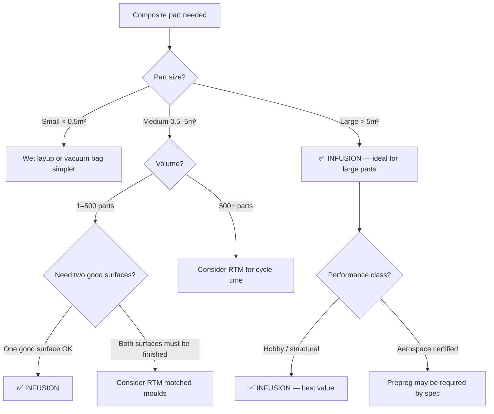

# Resin Infusion / VARTM

Resin infusion — formally called Vacuum Assisted Resin Transfer Moulding (VARTM) — flips the wet layup process on its head. Instead of wetting each ply by hand, you stack all your dry fabric plies on the mould first, seal them under a vacuum bag, then use the vacuum to pull liquid resin through the entire stack in one shot. The result is a more consistent, higher-quality laminate with better fibre volume fraction than wet layup, at a fraction of the cost of prepreg.

## How It Works


1. **Lay dry fabric** on the mould — all plies are stacked dry, which is much faster and cleaner than wetting each ply by hand.
2. **Add flow media** — a coarse mesh layer placed on top of (or sometimes between) the fabric stack. It acts like a highway for resin, allowing it to flow quickly across the surface before wicking down through the fabric thickness.
3. **Seal under vacuum bag** — similar to vacuum bagging, with inlet and outlet ports.
4. **Degas and check** — pull vacuum on the dry stack, check for leaks, and let trapped air evacuate.
5. **Open the resin inlet** — the vacuum draws resin from the pot, through the inlet tube, across the flow media, and through the fabric stack towards the outlet.
6. **Monitor the flow front** — through the transparent bag, you can see the resin advancing as a visible wet-out line. This is one of the great advantages of infusion — you can watch it happen.
7. **Clamp the inlet** — once resin reaches the outlet (or the part is fully wet), close the inlet. Leave the vacuum on during cure.
8. **Cure and demould** — room temperature or oven post-cure depending on the resin system.

```
Cross-section during infusion:

    ┌──────────────────────────────┐  ← Vacuum bag
    │  Breather                    │
    ├──────────────────────────────┤
    │  Flow media (distribution)   │  ← Resin races across this layer
    ├──────────────────────────────┤
    │  Peel ply                    │
    ├──────────────────────────────┤
    │  Dry fabric ply 4            │
    │  Dry fabric ply 3            │  ← Resin wicks downward
    │  Dry fabric ply 2            │     through the stack
    │  Dry fabric ply 1            │
    ├──────────────────────────────┤
    │  Release agent               │
    └══════════════════════════════┘  ← Mould surface

    Resin inlet →→→→→→→→→→→→→→→→ Vacuum outlet
```

## What You Get

| Property | Wet layup | VARTM | Prepreg/autoclave |
|---|---|---|---|
| Fibre volume fraction | 35–50% | 50–60% | 55–65% |
| Void content | 3–10% | 1–3% | < 1% |
| Surface quality (mould side) | Good | Good | Excellent |
| Consistency | Operator dependent | Repeatable | Very repeatable |
| Material cost | Low (dry fabric + resin) | Low (dry fabric + resin) | High (prepreg) |
| Equipment cost | Minimal | Moderate (pump, consumables) | Very high (autoclave) |

VARTM hits a sweet spot: near-prepreg quality at near-wet-layup cost for material.

## When to Use Resin Infusion

**Great for:**
- Large parts — boat hulls, wind turbine blades, bus panels, large fairings. Dry layup is much faster than wet layup for big parts.
- Medium production volumes (10–500 parts)
- Parts requiring good structural performance without autoclave cost
- Situations where you want both sides of the part to have reasonable surface quality (using a closed mould variant)

**Not ideal for:**
- Very small parts — the setup overhead (bag, tubing, flow media) doesn't pay off for a 100 mm bracket
- Ultra-high-performance aerospace parts requiring < 1% void content — use prepreg/autoclave
- Extremely thick laminates (> 20–25 mm) — resin may gel before fully wicking through the thickness

## Resin Selection for Infusion

Not all resins work for infusion. The resin must have:

- **Low viscosity** — typically below 300–500 mPa·s (centipoise) to flow through the fabric stack under vacuum alone. Standard laminating epoxies are often 1000+ cP and won't infuse well.
- **Adequate pot life** — the resin must stay liquid long enough to fill the entire part. A 2-metre boat hull might take 30–60 minutes to infuse. If the resin gels in 20 minutes, you get a partially wet part.
- **Low exotherm** — the large volume of resin in the pot and in the part can generate significant heat. Runaway exotherm can damage the part or the mould.

Infusion-specific epoxies, vinyl esters, and polyesters are formulated for these requirements.

## Flow Front Management

The most critical phase of infusion is watching and managing the resin flow front.

**Ideal flow:** Resin advances as a uniform line from inlet to outlet, fully wetting the fabric as it passes.

**Problems to watch for:**
- **Race-tracking** — resin follows the path of least resistance. If there is a gap between the fabric and the mould edge (e.g., a channel along a flange), resin races through that gap and reaches the outlet before the fabric is fully wet. Remedy: pack fabric tightly to mould edges, use tacky tape to seal channels.
- **Dry spots** — areas the resin never reaches, usually because the flow front bypassed them. Dry spots are scrap-level defects. Prevention: proper inlet/outlet placement, adequate flow media coverage.
- **Resin starvation** — the pot runs empty before the part is fully wet. Always prepare 10–20% more resin than your calculated volume.

## Inlet and Outlet Placement

Getting the inlet and outlet locations right is the key to a successful infusion.

**Common strategies:**
- **Edge-to-edge:** Inlet along one edge, vacuum outlet along the opposite edge. Simple, works for flat or gently curved panels.
- **Centre-to-perimeter:** Inlet at the centre of the part, outlets around the edges. Good for large flat panels — resin fills outward radially.
- **Multiple inlets:** For large or complex parts, use several inlet points to ensure full coverage before the resin gels.

**Rule of thumb:** Position inlets at the lowest point and outlets at the highest point (if possible) — gravity helps resin flow. But vacuum pressure dominates over gravity in most setups.

## When to Choose Infusion



**Choose infusion when:**
- Parts are medium to large (> 0.5 m²) — this is where infusion shines over wet layup
- You need 50–60% fibre volume fraction and 1–3% void content
- One finished (mould) surface is acceptable
- Production volume is 10–500 parts
- You want cleaner, more consistent results than wet layup without prepreg cost

**Do NOT choose infusion when:**
- Both surfaces must be finished (use RTM instead)
- Part is very small — setup time dominates (use wet layup + vacuum bag)
- Aerospace specification requires prepreg and autoclave
- Production volume exceeds 500 parts (RTM or HP-RTM may be faster per-part)

## Key Takeaways

- VARTM uses vacuum to pull resin through a dry fabric stack — cleaner, faster, and more consistent than wet layup
- Achieves 50–60% fibre volume fraction — significantly better than hand layup, close to prepreg
- Ideal for large parts: boat hulls, wind turbine blades, automotive panels
- Resin must have low viscosity (< 500 cP) and adequate pot life for the part size
- Flow front monitoring is essential — race-tracking and dry spots are the main risks
- Inlet/outlet placement determines whether the infusion succeeds or fails

## Further Reading / Tools

- [Vacuum Bagging](vacuum-bagging.md) — understanding vacuum pressure, which drives infusion
- [Wet Layup](wet-layup.md) — the simpler alternative for small parts
- [Common Defects](common-defects.md) — dry spots, voids, and other infusion problems
- [Resin Systems](../01-fundamentals/resin-systems.md) — choosing the right resin for infusion
- [Resin Flow Simulator — free infusion simulation](https://www.addcomposites.com/addcomposites-apps/resin-flow) — simulate your infusion strategy before committing to a layup
