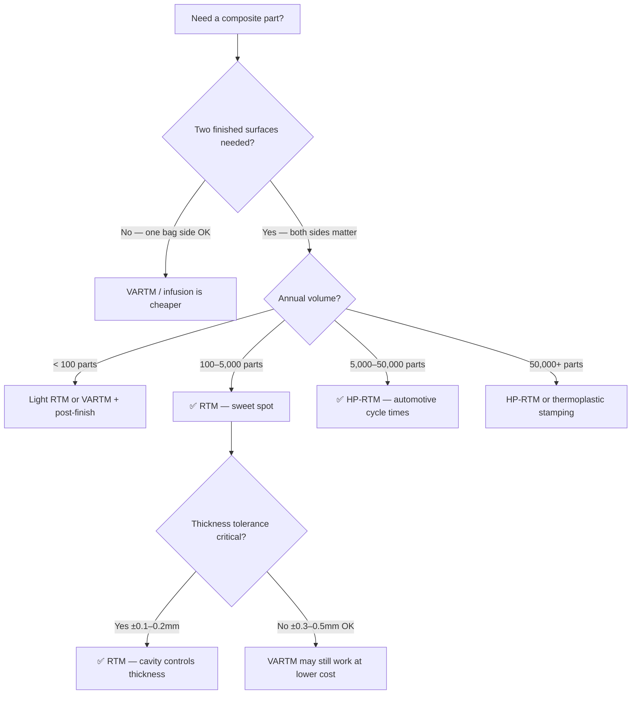

# RTM — Resin Transfer Moulding

Resin Transfer Moulding (RTM) uses matched moulds — a male and female tool clamped together — to inject resin under positive pressure into a dry fibre preform. Unlike VARTM (which uses vacuum only), RTM pushes resin in under 1–10 bar pressure, producing parts with two good surfaces, tight thickness control, and low void content. It sits between infusion and autoclave in both cost and quality.

## How It Works

```
RTM process (cross-section):

    Clamp force ↓
    ┌══════════════════════════════════┐  ← Upper mould (male)
    │                                  │
    │   ┌──────────────────────────┐   │
    │   │     Dry fibre preform    │   │  ← Cavity filled with
    │   │                          │   │     resin under pressure
    │   └──────────────────────────┘   │
    │                                  │
    └══════════════════════════════════┘  ← Lower mould (female)
         ▲                        ▲
      Resin in                Vent out
     (1–10 bar)             (air escapes)
```

1. **Create the preform** — cut dry fabric plies, stack them in the desired layup, and pre-shape (debulk or binder-tack) to match the mould cavity. For complex shapes, use a preform tool.
2. **Load the preform** — place the preform into the lower mould.
3. **Close the mould** — clamp upper and lower moulds together. Seals (O-rings) prevent resin leakage.
4. **Inject resin** — pump mixed resin into the cavity through inlet ports under controlled pressure (1–10 bar). Resin flows through the preform, displacing air.
5. **Vent air** — air exits through vent ports. Once resin appears at vents, close them.
6. **Cure** — moulds are heated (for elevated-temperature resins) or left at room temperature. Cure time depends on resin: 15 min–several hours.
7. **Demould** — open moulds, extract the cured part.

## RTM vs VARTM — What Is the Difference?

| Feature | VARTM (Infusion) | RTM |
|---------|------------------|-----|
| Mould | Single-sided + vacuum bag | Matched moulds (male + female) |
| Driving pressure | Vacuum only (~1 bar max) | Positive injection (1–10 bar) |
| Surfaces finished | One (mould side) | Both (both mould surfaces) |
| Thickness control | ±0.3–0.5mm (bag side varies) | ±0.1–0.2mm (cavity defines thickness) |
| Tooling cost | Low–moderate | High (two precision moulds + clamp) |
| Cycle time | 30 min–hours | 15 min–2 hours (faster fill under pressure) |
| Fibre volume fraction | 50–60% | 50–60% |
| Void content | 1–3% | 0.5–2% |
| Best volume range | 10–500 parts | 100–10,000 parts |

**Use RTM when:** you need two finished surfaces, tight tolerances, repeatable quality, and moderate-to-high production volumes. Use VARTM when tooling budget is limited and one bag-side surface is acceptable.

## Variants of RTM

**Light RTM (LRTM)** — uses a lightweight semi-rigid upper mould (often composite) instead of a heavy metal tool. Lower clamping force. Vacuum assists resin flow. Cost and quality sit between VARTM and full RTM.

**HP-RTM (High Pressure RTM)** — injects resin at 20–100+ bar with very fast fill times (30–120 seconds). Used in automotive production (BMW i3 body panels, Lamborghini structures). Requires heavy steel moulds and large hydraulic presses. Cycle time: 2–5 minutes per part.

**C-RTM (Compression RTM)** — moulds are initially slightly open during injection, then compressed to final thickness. Reduces injection pressure requirements and improves wet-out of thick preforms.

## Preform Preparation

The preform is critical to RTM success. A poorly made preform causes dry spots, fibre washing (fibres displaced by resin flow), or race-tracking (resin bypasses the preform along mould edges).

**Preform methods:**
- **Cut-and-stack** — cut plies from dry fabric, stack in the desired layup, place in mould. Simple but limited to relatively flat parts.
- **Binder-tacked preforms** — spray thermoplastic binder between plies, apply heat and pressure to create a semi-rigid preform that holds its shape. Essential for complex 3D parts.
- **Braided preforms** — tubular or flat braids created on a braiding machine. Excellent for tubes, T-joints, and complex curved structures. Continuous fibre, no splices.
- **Stitched preforms** — NCF (Non-Crimp Fabric) layers stitched together for handling. Good through-thickness reinforcement.

## Design Considerations

- **Minimum wall thickness:** ~1mm (depends on preform permeability and injection pressure)
- **Maximum wall thickness:** ~15–20mm (thick sections harder to wet out, risk of exothermic overheating)
- **Draft angles:** 1–3° minimum for demoulding from rigid moulds
- **Radii:** minimum 2–3mm internal radius (sharp corners trap air)
- **Inserts:** metal inserts can be placed in the preform before mould closure (fastener points, bushings)
- **Gate and vent placement:** critical for complete fill — simulate with resin flow analysis

## Common Defects

| Defect | Cause | Prevention |
|--------|-------|------------|
| **Dry spots** | Resin did not reach all areas | Optimise gate/vent placement, increase pressure, check preform permeability |
| **Fibre washing** | Resin flow displaced fibres | Reduce injection pressure, tack preform better, use binder |
| **Race-tracking** | Resin flows along mould edges bypassing preform | Ensure preform edges seal against mould, add edge dams |
| **Voids** | Trapped air not vented | Add vent lines at last-to-fill locations, use vacuum-assisted RTM |
| **Surface porosity** | Air trapped at mould surface | Adjust flow front, use gelcoat, increase mould temperature |

## Cost Structure

| Item | Range |
|------|-------|
| **Matched moulds** (composite) | $5,000–$30,000 per set |
| **Matched moulds** (CNC aluminium) | $15,000–$100,000+ per set |
| **Injection equipment** | $10,000–$100,000 (pump, mixer, controls) |
| **Clamping system** | $5,000–$50,000 (hydraulic or mechanical) |
| **Material cost** | Similar to VARTM (dry fibre + resin) |
| **Labour per part** | Lower than VARTM (less bagging, faster cycle) |

RTM has higher upfront tooling cost than VARTM but lower per-part cost at volume. The crossover is typically around **100–200 parts**.

## When to Choose RTM



**Choose RTM when:**
- Both surfaces need to be finished (mould-quality surfaces on both sides)
- Tight thickness tolerance is required (±0.1–0.2mm)
- Production volume is 100–10,000 parts per year
- Lower void content than VARTM is needed (0.5–2%)
- Cycle time of 15 min–2 hours is acceptable

**Choose HP-RTM when:**
- Automotive production rates are needed (2–5 min per part)
- Annual volume exceeds 5,000 parts
- Budget for heavy steel moulds and hydraulic presses is available

## Key Takeaways

- RTM uses matched moulds and positive pressure injection — producing parts with two finished surfaces and tight tolerances
- Quality sits between VARTM and autoclave prepreg: 50–60% Vf, 0.5–2% voids
- Higher tooling cost than VARTM but lower per-part cost at volume (>100 parts)
- HP-RTM enables automotive production cycle times (2–5 minutes per part)
- Preform quality is critical — poor preforms cause dry spots, fibre washing, and defects
- Gate and vent placement should be analysed with resin flow simulation before committing to mould design

## Further Reading / Tools

- [Resin Infusion / VARTM](resin-infusion-vartm.md) — the single-sided alternative
- [Resin Flow Simulator — free tool](https://www.addcomposites.com/addcomposites-apps/resin-flow) — simulate flow front for gate/vent planning
- [Common Defects](common-defects.md) — defects relevant to all liquid moulding processes
- [Tooling Costs](../08-cost-estimation/tooling-costs.md) — mould cost estimation
- [Resin Systems](../01-fundamentals/resin-systems.md) — choosing the right resin for RTM
- [AddStack — free laminate calculator](https://addstack.addcomposites.com)
