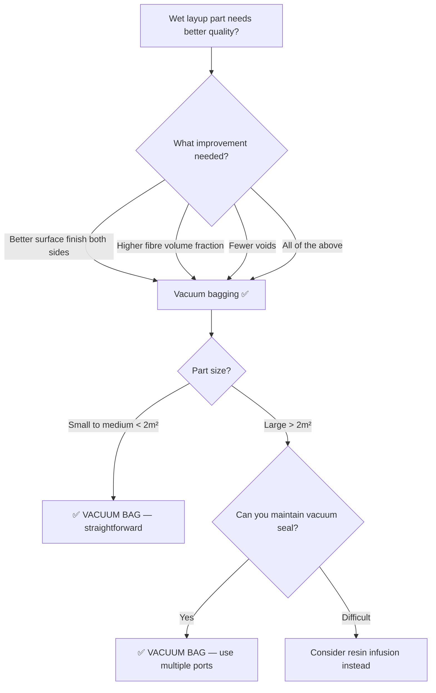

# Vacuum Bagging

Vacuum bagging is the most impactful single upgrade you can make to a wet layup process. By sealing the laminate under a flexible bag and pulling a vacuum, you apply roughly one atmosphere of pressure (~101 kPa / ~14.7 psi) uniformly over the entire part. This compacts the plies, squeezes out excess resin and trapped air, and produces a laminate that is thinner, lighter, stronger, and more consistent than open-mould wet layup alone.

## Why Vacuum Pressure Helps

Three things improve when you apply vacuum:

1. **Compaction** — the atmospheric pressure pushes plies tightly against each other and against the mould, reducing the laminate thickness and increasing fibre volume fraction from ~40% (hand layup) to ~50–55%.
2. **Void removal** — trapped air between plies is drawn out through the breather fabric to the vacuum port. Fewer voids means better interlaminar strength and fatigue life.
3. **Excess resin removal** — surplus resin bleeds into absorbent layers, bringing the resin content closer to the optimum ratio (~35–40% resin by weight for a UD laminate).

## The Vacuum Bag Stack

A typical vacuum bagging layup has several consumable layers stacked on top of the laminate. Each layer has a specific job.

```
Vacuum bag stack (cross-section, bottom to top):

    ┌──────────────────────────────┐  ← Vacuum bag (nylon film, sealed with sealant tape)
    │  Breather fabric             │  ← Allows air to flow to the vacuum port
    ├──────────────────────────────┤
    │  Bleeder fabric (optional)   │  ← Absorbs excess resin
    ├──────────────────────────────┤
    │  Release film (perforated)   │  ← Controls resin bleed rate
    ├──────────────────────────────┤
    │  Peel ply                    │  ← Gives a textured surface, easy to peel off
    ├──────────────────────────────┤
    │  LAMINATE (your part)        │  ← The composite plies
    ├──────────────────────────────┤
    │  Release agent               │  ← Prevents bonding to the mould
    └══════════════════════════════┘  ← Mould surface
```

### What Each Layer Does

**Peel ply** — a tightly woven nylon or polyester fabric placed directly on the laminate. It peels off after cure, leaving a clean, textured surface ready for bonding or painting. Without peel ply, the cured surface is smooth and resin-rich, requiring sanding before bonding.

**Release film** — a non-stick film (usually fluoropolymer or silicone-coated) with small perforations. It lets excess resin pass through the holes into the bleeder while preventing the bleeder from bonding to the laminate. Larger holes = more resin bleed.

**Bleeder** — a felt-like absorbent fabric that soaks up excess resin. The amount of bleeder controls how much resin is removed. More bleeder layers = drier laminate.

**Breather** — a thick, fluffy polyester fabric that maintains an air path from all areas of the bag to the vacuum port, even under full vacuum. Without a breather, the bag can pinch off airflow in corners.

**Vacuum bag** — a flexible nylon film that forms the sealed enclosure. Sealed to the mould flange with tacky butyl sealant tape. A vacuum fitting (port) connects through the bag to the vacuum pump.

## Step-by-Step Process

1. Lay up the laminate on the mould (wet layup or dry fabric for later infusion).
2. Apply peel ply over the entire laminate surface.
3. Add perforated release film.
4. Add bleeder fabric (1–3 layers depending on how much resin you want to remove).
5. Add breather fabric, extending to the vacuum port location.
6. Apply sealant tape around the mould perimeter.
7. Drape the vacuum bag film over everything, press it onto the sealant tape to form a seal.
8. Connect the vacuum port to the pump.
9. Pull vacuum — check for leaks by listening for hissing and monitoring the gauge.
10. Cure under vacuum (room temperature or in an oven).
11. Release vacuum, remove consumables, demould.

## Leak Detection and Prevention

A vacuum bag is only as good as its seal. Leaks are the number one source of problems.

**Symptoms of a leak:**
- Vacuum gauge never reaches full vacuum (should reach 850–950 mbar below atmospheric, or 50–150 mbar absolute)
- Gauge drops when pump is turned off
- Hissing sound

**Common leak locations:**
- Sealant tape joints, especially corners
- Around vacuum fittings
- Bag film punctures (from sharp ply edges or tools)
- Over mould flange irregularities

**Prevention:**
- Double-fold sealant tape at corners
- Use a continuous piece of bag film (fewer seams = fewer leaks)
- Check for sharp edges on plies before bagging
- Run a leak check before applying heat

## Vacuum-Only vs. Autoclave

Vacuum bagging applies ~1 atm (0.1 MPa) of pressure. An autoclave adds 3–7 atm of additional gas pressure (0.3–0.7 MPa) on top of the vacuum. The extra pressure further compacts the laminate, achieving fibre volume fractions of 55–65% and void contents below 1%.

| Parameter | Vacuum bag only | Autoclave |
|---|---|---|
| Compaction pressure | ~0.1 MPa | 0.3–0.7 MPa |
| Fibre volume fraction | 50–55% | 55–65% |
| Void content | 1–3% | < 1% |
| Equipment needed | Pump, bag, consumables | Autoclave vessel (expensive) |
| Typical users | Small shops, makers, repairs | Aerospace OEMs |

For most non-aerospace applications, vacuum-bag-only processing delivers excellent results.

## When to Choose Vacuum Bagging



**Choose vacuum bagging when:**
- You are already doing wet layup and want the single biggest quality improvement
- Fibre volume fraction of 50–55% is sufficient
- You need 1–3% void content (adequate for most structural applications)
- Budget allows ~$300–$1,000 for a vacuum pump and consumables
- Part is structural but not aerospace-certified

**Move to infusion or prepreg when:**
- You need fibre volume fraction above 55%
- Parts are large (> 2 m²) and wet layup becomes impractical
- You need < 1% void content (aerospace standard)

## Key Takeaways

- Vacuum bagging applies ~1 atm of uniform pressure, improving compaction, void removal, and resin content
- A proper bag stack includes peel ply, release film, bleeder, breather, and the vacuum bag itself
- Fibre volume fraction improves from ~40% (hand layup) to ~50–55% (vacuum bagged)
- Leak prevention is critical — check seals at corners, fittings, and bag film integrity
- Vacuum-only is sufficient for most non-aerospace applications; autoclaves add pressure for the highest quality
- This is the most cost-effective quality upgrade for any hand layup operation

## Further Reading / Tools

- [Wet Layup](wet-layup.md) — the base process that vacuum bagging improves
- [Prepreg and Autoclave](prepreg-and-autoclave.md) — the next level of quality beyond vacuum bagging
- [Common Defects](common-defects.md) — voids, dry spots, and other problems vacuum bagging helps prevent
- [Resin Infusion / VARTM](resin-infusion-vartm.md) — an alternative approach using vacuum to pull resin through dry fabric
