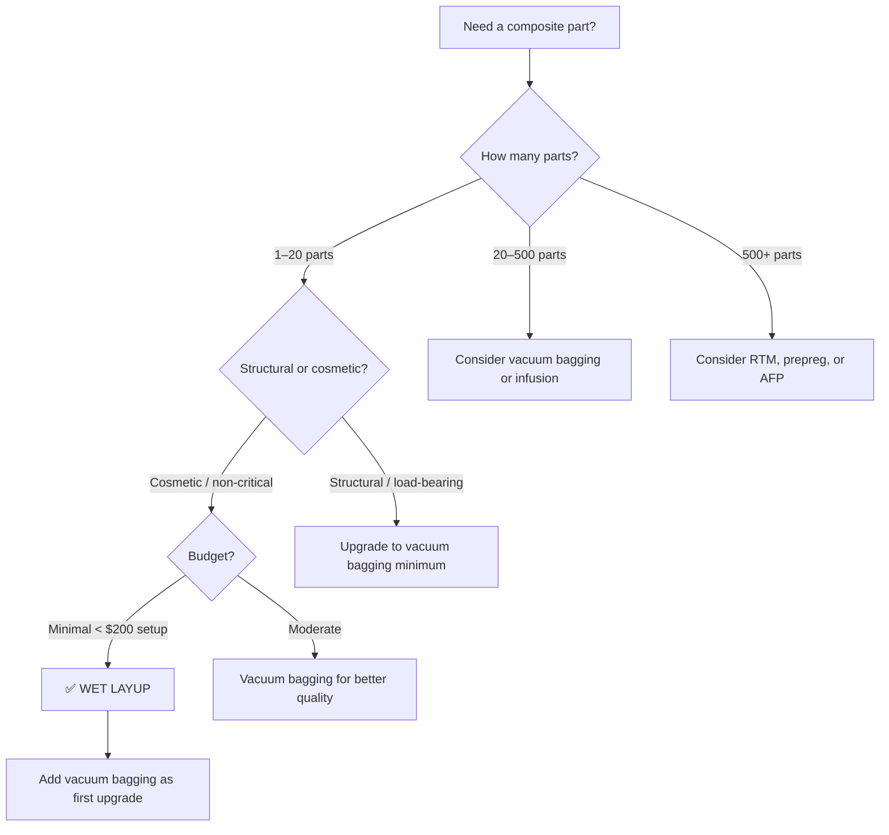

# Wet Layup

Wet layup (also called hand layup) is the simplest and most accessible way to make a composite part. You lay dry fabric onto a mould, wet it with liquid resin using a brush or roller, add more layers, and let it cure. No autoclave, no expensive equipment. This is where most makers, students, and small shops start.

## How It Works

The process in its simplest form:

1. **Prepare the mould** — apply release agent (wax, PVA, or chemical release) so the part does not bond permanently to the mould surface.
2. **Cut fabric plies** — cut your reinforcement (carbon, glass, or aramid fabric) to the shapes you need. Woven fabrics are most common for wet layup because they are easier to handle than unidirectional tape.
3. **Mix resin** — combine the resin with its hardener (for epoxy) or catalyst (for polyester/vinyl ester) in the correct ratio. Incorrect ratios mean incomplete cure or brittle parts.
4. **Lay and wet out** — place the first ply on the mould and work resin into it using a brush, squeegee, or ribbed roller. The goal is to fully saturate the fibres with no dry spots and no excess resin pools.
5. **Repeat** — add each subsequent ply, wetting out as you go. Use the roller to push out trapped air between layers.
6. **Cure** — leave the part to harden. Room-temperature epoxy typically cures in 12–24 hours. A post-cure at elevated temperature (60–80°C for a few hours) improves properties.
7. **Demould** — carefully remove the cured part from the mould.

```
Wet layup cross-section:

    ┌──────────────────────────────┐
    │        Fabric ply 3          │  ← wetted with resin
    ├──────────────────────────────┤
    │        Fabric ply 2          │  ← wetted with resin
    ├──────────────────────────────┤
    │        Fabric ply 1          │  ← wetted with resin
    ├──────────────────────────────┤
    │    Release agent layer       │
    └══════════════════════════════┘  ← mould surface
```

## What You Get (and What You Don't)

**Fibre volume fraction:** 35–50% typical. This is lower than prepreg or infusion processes because hand rolling cannot remove all excess resin. More resin means heavier parts with lower specific properties.

**Surface quality:** One good surface (the mould side). The other surface (the bag side or free surface) is rough and resin-rich.

**Dimensional tolerance:** Moderate. Thickness varies because the resin content is not precisely controlled.

**Strength and stiffness:** Adequate for many applications but 20–40% lower than the same fibre/resin combination processed by vacuum infusion or autoclave prepreg, because of the lower fibre volume fraction and higher void content.

## When to Use Wet Layup

| Good for | Not ideal for |
|---|---|
| Prototypes and one-off parts | High-performance structural parts |
| Small production runs (< 50 parts) | Tight weight targets |
| Learning composites fabrication | Repeatable, dimensionally precise parts |
| Non-structural or lightly loaded parts | Anything requiring high fibre volume fraction |
| Budget-constrained projects | Large parts (hard to wet out before resin gels) |

**Typical applications:** Car body kits, surfboards, small boat repairs, cosmetic fairings, maker projects, student Formula cars, drone shells.

## Common Resins for Wet Layup

- **Epoxy** — best all-round properties, low odour, longer working time (45–90 min typical). More expensive.
- **Polyester** — cheapest option, strong styrene smell, shorter working time (15–30 min). Good for large, less critical parts.
- **Vinyl ester** — better toughness and chemical resistance than polyester, similar handling. Popular for marine.

See [Resin Systems](../01-fundamentals/resin-systems.md) for detailed comparison.

## Tips for Better Results

1. **Control your resin ratio** — weigh resin and hardener on a digital scale. Guessing leads to incomplete cure.
2. **Work in sections** — on larger parts, wet out one area at a time rather than pre-mixing all your resin. This prevents gelling before you finish.
3. **Roll thoroughly** — trapped air becomes voids. Use a ribbed roller and work from the centre outward to push bubbles to the edge.
4. **Temperature matters** — resin viscosity drops in warm conditions, making wet-out easier. But resin also cures faster in heat, shortening your working time. Ideal shop temperature: 18–25°C.
5. **Wear PPE** — gloves, safety glasses, and a respirator (especially with polyester). Resin on skin causes sensitisation over time.

## Upgrading from Basic Wet Layup

Wet layup is the starting point. Each upgrade improves part quality:

- **Add vacuum bagging** → better compaction, fewer voids, higher fibre volume (45–55%). See [Vacuum Bagging](vacuum-bagging.md).
- **Switch to resin infusion** → dry fabric laid up first, resin pulled through under vacuum. Even higher fibre volume (50–60%). See [Resin Infusion / VARTM](resin-infusion-vartm.md).
- **Switch to prepreg** → resin pre-impregnated into the fibre. Best properties but needs freezer storage and autoclave or oven cure. See [Prepreg and Autoclave](prepreg-and-autoclave.md).

## When to Choose Wet Layup



**Choose wet layup when:**
- You are making 1–20 parts and structural performance is not critical
- You are learning composites for the first time
- Budget is minimal (< $200 total setup cost)
- The part is cosmetic, non-structural, or a prototype
- You are doing a repair on an existing composite structure

**Do NOT choose wet layup when:**
- The part is load-bearing and safety-critical
- You need fibre volume fraction above 50%
- Void content below 3% is required
- You need repeatable, consistent properties across many parts

## Key Takeaways

- Wet layup is the simplest composite manufacturing method — brush or roll liquid resin into dry fabric on a mould
- Typical fibre volume fraction is 35–50%, lower than other processes
- Good for prototypes, small runs, learning, and non-critical parts
- Resin choice depends on budget (polyester cheapest), performance (epoxy best), and working time
- Add vacuum bagging as the first upgrade for significantly better properties
- Always weigh resin and hardener precisely, and wear proper PPE

## Further Reading / Tools

- [Vacuum Bagging](vacuum-bagging.md) — the natural next step up from wet layup
- [Resin Systems](../01-fundamentals/resin-systems.md) — choosing the right resin
- [Common Defects](common-defects.md) — what can go wrong and how to fix it
