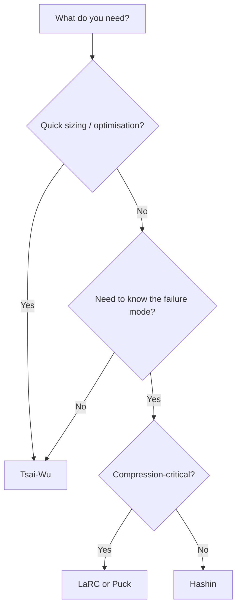

# Failure Criteria for Composites

In metals, you check von Mises stress against yield strength and you are mostly done. Composites are not that simple. A composite ply can fail in multiple independent ways — fibre tension, fibre compression, matrix tension, matrix compression, shear — and these failures interact differently depending on the criterion you choose. A failure criterion is the mathematical rule that takes the ply stresses from your CLT analysis and tells you whether the ply has failed.

## Why Multiple Criteria Exist

No single failure criterion perfectly predicts composite failure in all loading conditions. Each criterion makes different assumptions about how failure modes interact. The result: a ply that "passes" under one criterion may "fail" under another for the same stress state. This is not a flaw — it reflects the genuine complexity of composite failure.

In practice, your company, customer, or certification authority will specify which criterion to use. If you are working without that guidance, this page helps you choose.

## Maximum Stress Criterion

**The idea:** Compare each stress component independently against its allowable. The ply fails when any single stress component exceeds its allowable.

```
Check each independently:
  σ₁ < X_t  (fibre-direction tension)
  |σ₁| < X_c  (fibre-direction compression)
  σ₂ < Y_t  (transverse tension)
  |σ₂| < Y_c  (transverse compression)
  |τ₁₂| < S   (in-plane shear)
```

**Pros:**
- Simple and intuitive
- Tells you exactly which stress component drives failure
- Conservative for single-component loading

**Cons:**
- Does not capture interaction between stress components
- Can be non-conservative under combined loading (e.g., tension + shear simultaneously)

**Use when:** You need a quick, transparent first check, or when loads are primarily in one direction.

## Maximum Strain Criterion

**The idea:** Same as maximum stress, but compare strains instead of stresses.

Functionally very similar to maximum stress for linear-elastic materials. The difference matters when thermal or hygroscopic (moisture) effects are included — strain-based criteria handle residual strains more naturally.

**Use when:** Thermal or moisture effects are significant.

## Tsai-Wu Criterion

**The idea:** A single equation that combines all stress components into one **failure index (FI)**. The ply fails when FI ≥ 1.

Tsai-Wu accounts for interaction between all stress components. It produces a smooth failure envelope — an ellipsoid in stress space. One number tells you the overall safety of the ply.

**Pros:**
- Captures stress interaction (combined tension + shear, etc.)
- Single failure index makes optimisation straightforward
- Widely used, well understood, implemented in most tools

**Cons:**
- Does not distinguish between failure modes — a failure index of 1.0 could be fibre breakage or matrix cracking, and you don't know which
- Requires an interaction coefficient (F₁₂) that is difficult to measure experimentally — different assumed values give different results
- Can be non-conservative for compressive fibre failure under certain biaxial loads

**Use when:** You want a single index for preliminary sizing, optimisation, or comparing laminates. The most common criterion for general-purpose composites design.

## Tsai-Hill Criterion

A predecessor to Tsai-Wu with a simpler interaction equation. Does not distinguish between tensile and compressive allowables in the same direction. Largely superseded by Tsai-Wu but still seen in older analyses and textbooks.

## Hashin Criterion

**The idea:** Separate the failure check into distinct **failure modes**, each with its own equation:
1. Fibre tension failure
2. Fibre compression failure
3. Matrix tension failure
4. Matrix compression failure

Each mode has its own failure index. The ply fails when any one mode reaches FI ≥ 1.

**Pros:**
- Tells you HOW the ply fails, not just that it fails
- More physically meaningful than Tsai-Wu
- Widely used in aerospace and implemented in most FEA software

**Cons:**
- More complex than single-index methods
- The fibre compression mode is simplified — it does not capture all micro-buckling physics

**Use when:** You need to know the failure mode (fibre vs. matrix) — important for damage tolerance, progressive failure analysis, and understanding the structural reserve after first ply failure.

## Puck Criterion

**The idea:** An extension of Hashin that adds fracture-plane analysis for matrix failure. Instead of just checking that the matrix has failed, Puck predicts the angle of the fracture plane and the type of matrix failure (tension-driven, compression-driven, or shear-driven).

**Pros:**
- Most physically accurate for matrix failure under combined loading
- Predicts inter-fibre failure (IFF) modes A, B, and C — useful for damage tolerance
- Adopted in German aerospace standards (Puck is widely used in European aerospace)

**Cons:**
- Complex to implement and understand
- Requires additional material parameters

**Use when:** Detailed matrix failure characterisation is needed, or when design standards require it.

## LaRC Criteria

**The idea:** Developed by NASA Langley Research Center. Addresses compressive fibre failure more rigorously than Hashin by modelling fibre kinking as a matrix-dominated failure on a misaligned plane.

**Pros:**
- Best available prediction for compressive fibre failure
- Physically based — captures the kinking mechanism

**Cons:**
- Most complex of the common criteria
- Requires additional parameters (fibre misalignment angle)

**Use when:** Compressive fibre failure is the critical mode — e.g., spar caps, stiffener flanges, buckling-critical structure.

## Choosing a Failure Criterion



| Criterion | Complexity | Failure mode info | Best for |
|---|---|---|---|
| Max stress | Low | Yes (per component) | Simple, transparent checks |
| Max strain | Low | Yes (per component) | Thermal/moisture cases |
| Tsai-Wu | Medium | No (single index) | Preliminary sizing, optimisation |
| Hashin | Medium | Yes (4 modes) | General aerospace analysis |
| Puck | High | Yes (detailed matrix) | European aerospace, matrix-critical |
| LaRC | High | Yes (detailed fibre) | Compression-critical structure |

## First Ply Failure vs. Last Ply Failure

Most criteria check each ply independently. But when one ply fails (e.g., matrix cracking in a 90° ply), the laminate does not necessarily collapse — the remaining plies redistribute the load.

- **First Ply Failure (FPF):** The load at which the first ply reaches its failure index. Conservative — the laminate is still functional.
- **Last Ply Failure (LPF):** The load at which the entire laminate collapses. Requires progressive failure analysis (degrading the stiffness of failed plies and recalculating).

Most design uses FPF as the limit. LPF is used for understanding ultimate reserve strength.

## Failure Criteria Quick-Selection Table

| Criterion | Complexity | Failure Modes? | Stress Interaction? | Best For | Tool Support |
|-----------|-----------|----------------|-------------------|----------|-------------|
| **Max Stress** | Simple | No | No | Quick checks, preliminary sizing | All tools |
| **Max Strain** | Simple | No | No | Strain-based design | All tools |
| **Tsai-Wu** | Moderate | No (single index) | Yes | General structural, optimisation | AddStack, eLamX2, all FEA |
| **Tsai-Hill** | Moderate | No | Yes | Legacy programs | Most tools |
| **Hashin** | Moderate | Yes (4 modes) | Partial | Aerospace certification, FEA | ABAQUS, ANSYS, AddStack |
| **Puck** | High | Yes + fracture plane | Yes | Research, matrix-dominated failure | eLamX2, LS-DYNA MAT261 |
| **LaRC03/04** | High | Yes + kink band | Yes | Research, compression failure | NASA CompDam (open source) |

**Decision shortcut:**
- **Just starting?** → Max Stress (simplest, conservative)
- **Designing a real part?** → Tsai-Wu (single failure index, accounts for stress interaction)
- **Aerospace FEA?** → Hashin (separates fibre vs matrix failure, required by many specs)
- **Research?** → Puck or LaRC (most physically accurate)

For detailed guidance, see the decision tree: `decision-trees/failure-criteria-selection.json`

## Key Takeaways

- No single failure criterion is correct for all situations — the choice depends on what information you need and what your design standard requires
- Maximum stress is simplest; Tsai-Wu gives a single index for optimisation; Hashin identifies failure modes; Puck and LaRC add physics-based detail
- Tsai-Wu is the most common general-purpose criterion — use it for preliminary design
- Hashin is standard for aerospace FEA where failure mode identification matters
- Always understand whether you are checking First Ply Failure (conservative) or Last Ply Failure (progressive)

## Further Reading / Tools

- [Sizing a Panel](sizing-a-panel.md) — applying failure criteria in a sizing workflow
- [Failure Modes](../01-fundamentals/failure-modes.md) — the physical mechanisms that failure criteria try to predict
- [Laminate Theory](../01-fundamentals/laminate-theory.md) — CLT provides the ply stresses that feed into failure criteria
- [AddStack — free laminate calculator](https://addstack.addcomposites.com) — check laminates against multiple failure criteria
