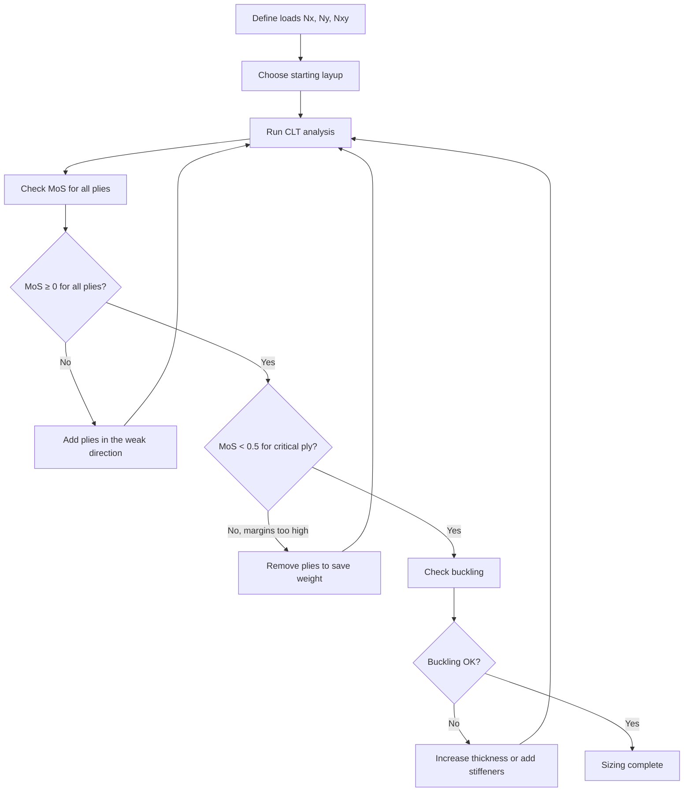

# Sizing a Composite Panel

Sizing is the process of determining how many plies, at what angles, you need to carry a given set of loads. This page walks through a simplified but realistic example: sizing a flat rectangular composite panel under in-plane loads. The goal is to understand the workflow, not to replace a stress engineer — but this is exactly the workflow that stress engineers follow, just with more detail.

## The Inputs You Need

Before you can size anything, you need three things:

1. **Loads** — what forces and moments act on the panel? For preliminary sizing, these are expressed as **running loads** (force per unit width, in N/mm):
   - Nx = running load in the x-direction (tension or compression)
   - Ny = running load in the y-direction
   - Nxy = in-plane shear running load

2. **Material properties** — the ply-level properties of your chosen fibre/resin system: E1, E2, G12, ν12, and the allowable strengths (tensile, compressive, shear) in each direction. These come from the material datasheet or testing.

3. **Design requirements** — the failure criterion to use (e.g., max stress, Tsai-Wu), the required margin of safety, and any stacking rules (symmetry, balance, 10% rule, etc.).

## Step 1: Estimate the Dominant Load Direction

Look at the load ratios. If Nx is much larger than Ny and Nxy, the panel is primarily axially loaded — you will want a 0°-dominated laminate. If Nxy dominates, you need a ±45°-dominated laminate. For roughly equal Nx, Ny, and Nxy, start with quasi-isotropic.

| Load condition | Starting layup family |
|---|---|
| Axial tension or compression (Nx dominates) | 0°-dominated: ~50% at 0° |
| Shear (Nxy dominates) | ±45°-dominated: ~50% at ±45° |
| Biaxial (Nx ≈ Ny) | Quasi-isotropic: 25% each direction |
| Combined | Blend based on load ratios |

## Step 2: Pick a Starting Stacking Sequence

Choose a laminate family and define a first-guess stacking sequence. Respect all [stacking rules](../02-design-rules/stacking-sequences.md): symmetry, balance, 10% minimum in each direction, no more than 3–4 consecutive same-angle plies.

**Example:** A panel with Nx = -200 N/mm (compression), Ny = -50 N/mm, Nxy = 80 N/mm.

The compression is dominant, so start 0°-heavy. First guess: [±45/0₂/90/0/±45/0/90]s = 20 plies.

## Step 3: Run CLT Analysis

Feed the stacking sequence and loads into a Classical Laminate Theory tool. [AddStack](https://addstack.addcomposites.com) or [eLamX2](https://elamx2.de) will do this for you.

The tool calculates:
- Ply-by-ply stresses and strains
- Failure indices for each ply using your chosen failure criterion
- Overall laminate stiffness (ABD matrix)

## Step 4: Check the Margin of Safety

The **margin of safety (MoS)** tells you how much reserve strength you have:

```
MoS = (Allowable / Applied) - 1

MoS > 0  → the ply passes
MoS = 0  → the ply is exactly at its limit
MoS < 0  → the ply fails — redesign needed
```

Check the MoS for every ply. The critical ply (lowest MoS) governs the design.

**Typical required margins:**
- MoS ≥ 0 at ultimate load (the structure must not fail)
- Some programmes require MoS ≥ 0.1 or higher to account for uncertainties

## Step 5: Iterate

If the margin is too low (ply fails), add plies — typically in the direction of the failed ply. If the margin is excessively high (MoS > 0.5 everywhere), you may be able to remove plies to save weight.



## Step 6: Check Buckling

Strength is not enough. A thin panel under compression will buckle before the material fails. After the strength check passes, run a buckling analysis:

- For a simply supported flat panel, buckling load depends on panel dimensions, laminate bending stiffness (D-matrix), and boundary conditions.
- See [Buckling Basics](buckling-basics.md) for the approach.
- If the panel buckles before reaching the design load, you need a thicker laminate, a smaller unsupported panel (add stiffeners), or a sandwich construction.

## Worked Example Summary

**Given:** Flat rectangular panel, 500 × 300 mm, simply supported edges.
- Nx = -200 N/mm (compression)
- Ny = -50 N/mm (compression)
- Nxy = 80 N/mm (shear)
- Material: standard modulus carbon/epoxy UD prepreg

**Design iteration:**
1. Start with [±45/0₂/90/0/±45/0/90]s = 20 plies (2.6 mm thick)
2. CLT analysis → critical ply MoS = -0.15 (fails in compression)
3. Add two 0° plies → [±45/0₂/90/0₂/±45/0/90]s = 22 plies (2.86 mm)
4. CLT analysis → critical ply MoS = +0.08 (passes)
5. Buckling check → panel buckles at 85% of design load (fails)
6. Options: increase to 24 plies, or add a stiffener, or switch to sandwich
7. Add two more ±45° plies for bending stiffness → 24 plies (3.12 mm)
8. Buckling check → passes with 15% margin
9. Final layup: [±45/0₂/90/0₂/±45₂/0/90]s = 24 plies

This is a simplified example. In practice, you would also check: bearing loads at fasteners, damage tolerance (with assumed BVID), environmental knockdowns (hot/wet conditions), and fatigue.

## Key Takeaways

- Sizing starts with running loads (N/mm), material properties, and a chosen failure criterion
- Pick a starting layup family based on the dominant load direction
- Use a CLT tool (AddStack, eLamX2) to check ply-by-ply failure margins
- Iterate: add plies where margins are negative, remove where they are excessive
- Always check buckling after strength — thin panels under compression buckle before the material fails
- This workflow is how real sizing is done — the tools just add more detail and load cases

## Further Reading / Tools

- [Failure Criteria](failure-criteria.md) — which failure criterion to use and when
- [Buckling Basics](buckling-basics.md) — understanding compressive stability of thin laminates
- [Laminate Theory](../01-fundamentals/laminate-theory.md) — the CLT math behind the sizing tool
- [Stacking Sequences](../02-design-rules/stacking-sequences.md) — rules your final layup must satisfy
- [AddStack — free laminate calculator](https://addstack.addcomposites.com) — run CLT analysis and failure checks
