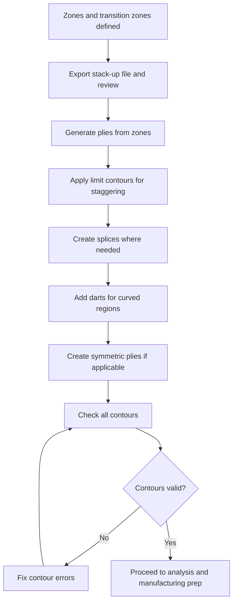

# Ply Creation Workflow

Once zones are defined in the preliminary design phase, the next step is to create individual plies — the actual layers of material that will be manufactured. This is where the design transitions from "conceptual thickness map" to "specific plies with contours, materials, directions, and stacking order." The ply creation workflow is the core of detailed composites design.

## From Zones to Plies

The most common approach is to **generate plies automatically from zone definitions**. The tool reads each zone's laminate (e.g., 4 plies at 0°, 2 at +45°, 2 at -45°, 2 at 90°) and creates individual ply features for each layer, with their contours derived from the zone and transition zone geometry.

Before generating plies, you can export a **stack-up file** — a text file listing the proposed stacking order. This lets you review and modify the default stacking before committing to ply creation. The stack-up file contains:
- Ply geometric level (position in the stack)
- Material
- Orientation angle
- Set of zones the ply spans

## Options During Ply Generation

Several options control how plies are created from zones:

**With or without staggering:** Staggering offsets the ply drop-off boundaries between adjacent plies so they do not coincide. Creating plies "with staggering" automatically generates staggered contours based on the transition zone geometry. Creating "without staggering" produces plies with coincident drop-off edges — useful as a starting point that you then manually stagger.

**With or without taper:** When transition zones exist, plies can be created with taper geometry — meaning the ply contours follow the transition zone ramp, producing plies of varying extent.

**Full plies and ETBS:** "Edges To Be Staggered" (ETBS) are automatically identified — these are the common edges between adjacent zones where ply drops occur. Generating ETBS alongside plies provides the geometric references needed to later create staggered limit contours.

**In a new group:** Plies are typically created inside a new plies group under the stacking node. Multiple groups can exist for different zones groups.

## Manual Ply Creation

Not all plies come from zones. You can create plies manually by specifying:
- A **contour** — one or more closed curves on the reference surface
- A **material** from the material catalogue
- A **direction** (fibre orientation angle, referenced to the rosette)
- A **surface** the ply conforms to

Manual plies are used for local reinforcements, patches, repair plies, or any ply that does not fit the zone-based design.

## Modifying Plies After Creation

Plies generated from zones are a starting point. Typical modifications include:

### Limit Contours (Staggering)

A **limit contour** redefines a ply's boundary to implement staggering. Using the ETBS and staggering data from zone-based ply creation, you can offset ply edges by a specified stagger value and direction. This produces the staggered ply drop-offs required by design rules (see [Ply Drop-offs](../02-design-rules/ply-drop-offs.md)).

Parameters for a limit contour:
- **Staggering direction** — which way to offset the edge
- **Staggering step** — the offset distance per ply (e.g., 6 mm)
- **Staggering value** — the total offset for this particular ply

### Splices

When a ply is too wide for a single material strip, **splices** divide it into sections. The splice tools create:
- **Butt splice zones** — regions where ply sections meet with a gap
- **No-splice zones** — regions where splices are prohibited (near bolt holes, high-stress areas)
- **3D multi-splice** — splits a ply into multiple overlapping sections on curved surfaces, with control over overlap value, stagger direction, and stagger value

See [Splices and Joints](../02-design-rules/splices-and-joints.md) for the design rules.

### Darts

A **dart** is a relief cut in a ply that allows it to conform to a doubly-curved surface without wrinkling. Darts are created by cutting the ply along a line or curve, allowing the two halves to overlap or gap slightly. Dart creation tools let you define the cut geometry and manage the resulting ply sections.

## Plies from Slicing (Alternative Approach)

An alternative to zone-based ply creation is **slicing** — generating plies by slicing a 3D solid model into layers. This is useful when:
- Reverse-engineering a part from a solid CAD model or CT scan
- Working with imported FEA solid models that already have thickness information
- The geometry is too complex for straightforward zone decomposition

Slicing parameters:
- **Input zones group** — the solid to slice
- **Slicing method** — constant thickness (uniform slices) or variable (following a thickness law)
- **Slicing thickness** — the nominal ply thickness for each slice
- **Curve degree** — controls the smoothness of the sliced contours
- **Geometrical level** — which surface of the solid each slice corresponds to

The sliced output creates a new plies group with plies whose contours follow the intersection of the slicing planes with the solid geometry.

## Manual Ply Creation — Full Workflow

Manual ply creation is used for plies that do not fit the zone-based or slicing approaches:
- Local reinforcement patches
- Repair plies in service
- Inserts and doublers
- Plies that span multiple zones groups with custom contours

Each manually created ply requires: a **surface** to conform to, a **contour** (one or more closed curves), a **material**, a **direction** (fibre angle), and a **rosette** reference. The ply is inserted into the stacking tree under the selected sequence or plies group.

## Ply Merging, Relimiting, and Re-routing

After initial ply creation, several modification operations refine the laminate:

**Merging plies:** When two adjacent plies of the same material, direction, and position in the stack can be combined into one, merging simplifies the model. Merging stackings combines two separate stacking trees into one — useful when independent designs must be unified.

**Relimiting plies:** After geometry changes (zone contour edits, surface modifications), ply contours may no longer match the updated geometry. Relimiting re-computes the ply contour to conform to the current geometry.

**Re-routing ply contours:** Changes the path of a ply boundary — specifying a new route between a start vertex and end vertex. Options include routing to the other side of a feature or matching the shape of similar plies. This is used when a ply must deviate from its auto-generated contour to accommodate manufacturing constraints or avoid interference.

**Removing ply shells:** After modifications, redundant ply shell geometry can be cleaned up to keep the model lean.

## Checking Contours

After modifying ply contours, a contour check verifies that:
- All ply contours are closed (no gaps)
- Plies do not extend beyond the Edge of Part (EOP)
- Adjacent plies have proper overlap or gap as intended
- Stagger distances are consistent

## Ply Exploder (Visualisation)

To inspect the laminate, a **ply exploder** separates the plies visually — pulling them apart in the thickness direction so you can see each ply's contour individually. Options include:

- Explode individual plies or entire ply groups
- Show each ply as a constant-offset surface, a tessellated surface, or a shell
- Include or exclude core samples
- Scale the separation for clarity

This is invaluable for design reviews and catching errors that are invisible in the compressed laminate view.

## Symmetric Plies

For symmetric laminates (mirrored about the midplane), you define only one half of the stacking and then create **symmetric plies** — the tool automatically mirrors the stacking sequence. This ensures perfect symmetry and halves the manual definition work.

Options:
- **Pivot** — the ply at the midplane is shared (not duplicated)
- **Non-pivot** — the midplane ply is duplicated

## Workflow Summary

## Key Takeaways

- Plies are generated automatically from zone definitions, with the option to review and modify the stacking order via a stack-up file
- Limit contours implement ply staggering by offsetting drop-off edges by a defined step
- Splices, darts, and manual plies handle real-world manufacturing constraints beyond what zone-based generation produces
- Symmetric ply creation ensures perfect laminate symmetry with half the definition work
- Contour checking validates ply geometry before moving to analysis and manufacturing
- The ply exploder is an essential visualisation tool for design review

## Further Reading / Tools

- [Zone and Group Management](zone-and-group-management.md) — the preliminary design step that feeds ply creation
- [Stacking and Sequences](stacking-and-sequences.md) — organising plies into the manufacturing stacking order
- [Stacking Sequences](../02-design-rules/stacking-sequences.md) — design rules the stacking must follow
- [Splices and Joints](../02-design-rules/splices-and-joints.md) — design rules for ply splices

> Workflow concepts informed by CATIA V5 Composites Design documentation.
