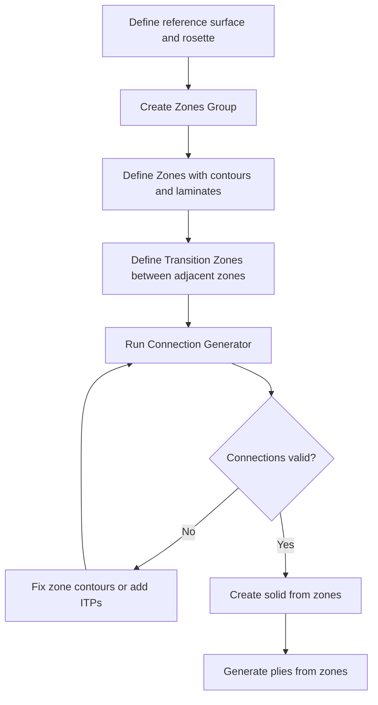

# Zone and Group Management in Composites Design

Before individual plies exist, a composite part starts as a collection of **zones** — regions of constant laminate definition. Zone and group management is the preliminary design phase: you define where different laminates live on the part, how they connect, and where thickness transitions (tapers) occur. This workflow is fundamental to any composites CAD tool, not just one specific package.

## The Hierarchy: Groups, Zones, and Transition Zones

Composites preliminary design follows a clear hierarchy:

```
Zones Group
├── Zone A (laminate: 12 plies, material X)
│   ├── Transition Zone T1 (taper from A to B)
│   └── Transition Zone T2 (taper from A to C)
├── Zone B (laminate: 8 plies, material X)
│   └── Transition Zone T3 (taper from B to D)
├── Zone C (laminate: 10 plies, material X)
└── Zone D (laminate: 6 plies, material X)
```

### Zones Group

A **zones group** is a container for zones that share a common reference surface and draping direction. Think of it as a single panel or skin section of your structure.

Every zones group needs:
- A **reference surface** — the geometric surface the zones are defined on
- A **draping direction** — which side of the surface the material is applied to
- A **rosette** (coordinate system) — defines the axis system for fibre orientation angles. Two types are common:
  - **Cartesian rosette** — suitable for panels with low curvature (flat or gently curved)
  - **Cylindrical rosette** — suitable for parts with high curvature (fuselage barrels, ducts). Uses a neutral fibre (the axis of the cylinder) to define the reference direction

### Zones

Each **zone** is a closed geometric region on the reference surface with a constant laminate definition. A zone contains:
- A **contour** — one or more closed curves that define the zone boundary. The contour must lie on the reference surface.
- A **laminate** — the number of layers per material/direction combination (e.g., 4 plies at 0°, 2 at +45°, 2 at -45°, 2 at 90° in Material X)
- A **rosette** reference for fibre directions

From the laminate definition, the zone's thickness is computed automatically (number of layers × material ply thickness).

### Transition Zones

A **transition zone** defines the geometric area where ply drop-offs occur between two adjacent zones of different thickness. It sits on top of (and within) an underlying zone.

The transition zone's contour must lie within the underlying zone. The taper geometry — the ramp from thicker to thinner — is generated within this region.

## Connection Generation

Once zones and transition zones are defined, a **connection generator** computes the tangency connections between them. This determines:

- How zone edges meet (structural zone edges)
- Where thickness interpolation points (constant thickness points) fall
- How transition zone edges connect to the zones above and below

Connection generation validates that the zone layout is geometrically consistent before plies are created. If connections cannot be resolved (e.g., gaps between zones, overlapping contours), the tool flags the errors.

## Imposed Thickness Points (ITPs)

At some locations — particularly where multiple transition zones meet at a single vertex — the thickness is not automatically determined by adjacent zones. An **Imposed Thickness Point (ITP)** lets you manually specify the laminate thickness at a particular point.

Two variants:
- **ITP** — specifies an integer number of plies at a point (the stack must be an exact multiple of ply thickness)
- **ITP Height** — specifies a decimal height value at a point (supports non-integer thicknesses and multi-material scenarios)

ITPs are placed at vertices where transition zones converge and the thickness would otherwise be ambiguous.

## Creating Solids from Zones

The zone definitions and their connections can be used to generate a **solid model** representing the composite part's thickness. This solid is built by extruding each zone's laminate thickness from the reference surface, with transition zones creating the ramp geometry between thickness steps.

Options include:
- **Full solid** — includes both zones and transition zone ramps
- **Solid without transition zones** — only the flat (iso-thickness) regions, giving a rough space-allocation view
- **Top surface only** — generates the outer surface (opposite the reference surface), useful for mould design or interference checking

## Workflow Summary



## Key Takeaways

- Zones group → zones → transition zones is the standard hierarchy for preliminary composites design
- Each zone has a closed contour, a laminate definition, and a rosette reference
- Transition zones define the taper (ply drop-off) regions between zones of different thickness
- Connection generation validates geometric consistency before ply creation
- Imposed Thickness Points resolve ambiguous thickness at vertices where multiple transitions meet
- A solid model can be generated directly from zone definitions for space allocation and mould design

## Further Reading / Tools

- [Zone Design](../02-design-rules/zone-design.md) — the design principles behind zone layout
- [Ply Drop-offs](../02-design-rules/ply-drop-offs.md) — ramp ratios and stagger rules for transitions
- [Ply Creation Workflow](ply-creation-workflow.md) — creating individual plies from the zone definitions
- [Stacking and Sequences](stacking-and-sequences.md) — how plies are organised into sequences

> Workflow concepts informed by CATIA V5 Composites Design documentation.
