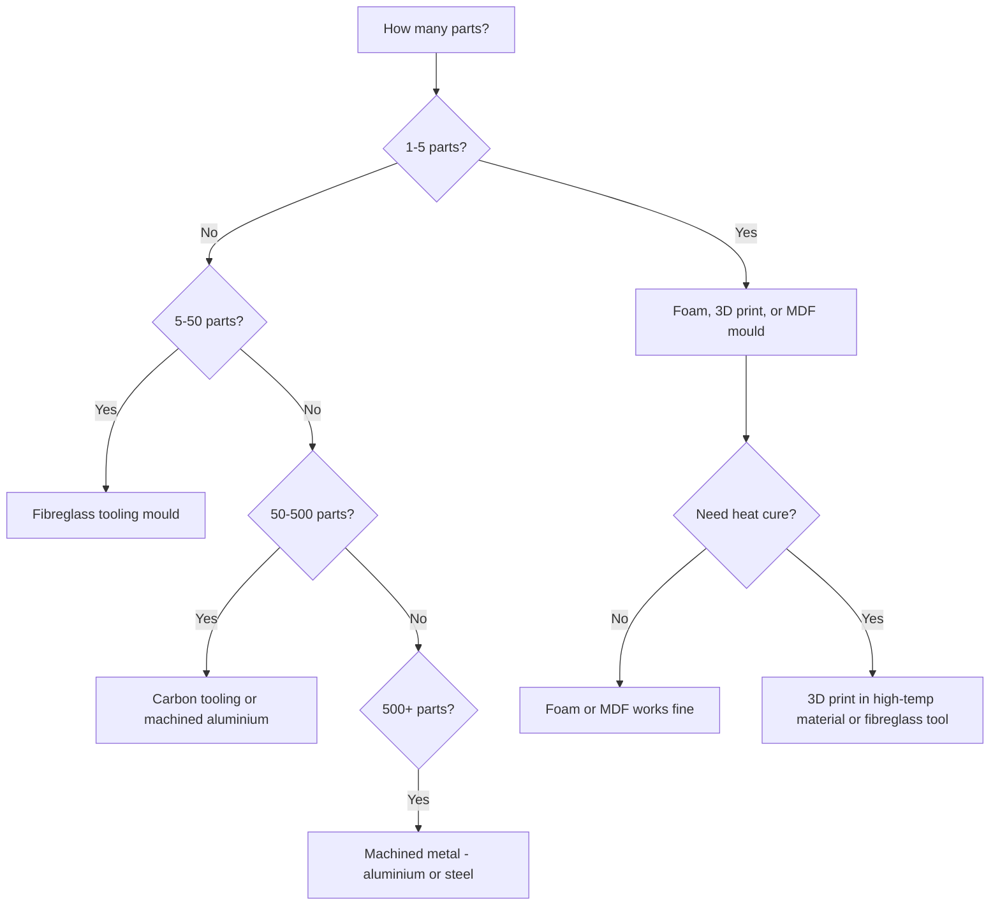

# Tooling and Mould Costs

In composites manufacturing, the mould (tool) defines your part's shape, surface quality, and dimensional accuracy. Tooling is often the largest single upfront cost — and the most underestimated. A mould that costs more than expected or fails after 20 parts can kill a project's economics.

## Mould Material Options

The mould material you choose depends on how many parts you need, what surface quality is required, and how much you can invest upfront.

| Mould Material | Cost per m2 (USD) | Expected Life (parts) | Surface Quality | Max Cure Temp |
|---------------|-------------------|----------------------|-----------------|---------------|
| **Foam (XPS/PU) + filler** | $20–100 | 1–5 | Low–moderate | Room temp only |
| **3D printed (FDM/SLA)** | $50–500 | 1–20 | Moderate (depends on print) | 60–120°C (material dependent) |
| **MDF/wood + sealant** | $30–100 | 5–20 | Low–moderate | Room temp only |
| **Fibreglass/epoxy tooling** | $100–500 | 20–200 | Good (gelcoat surface) | 80–120°C |
| **Carbon/epoxy tooling** | $300–1,500 | 50–500 | Very good | Up to 180°C |
| **Machined aluminium** | $500–3,000 | 500–10,000+ | Excellent | 200°C+ |
| **Machined steel** | $1,000–5,000 | 10,000–100,000+ | Excellent | 400°C+ |
| **Invar (low-CTE metal)** | $2,000–10,000 | 10,000+ | Excellent, dimensionally stable | 400°C+ |
| **Electroformed nickel** | $1,500–5,000 | 5,000–50,000 | Excellent | 350°C+ |

## Choosing the Right Mould for Your Volume



## Cost Examples by Part Type

### Small Part — Drone Frame Component (0.05 m2)

| Mould Approach | Mould Cost | Parts Before Replacement | Cost per Part (tooling) |
|---------------|-----------|------------------------|----------------------|
| 3D printed (PLA/PETG) | $20–50 | 5–10 | $4–10 |
| 3D printed (high-temp resin) | $50–150 | 10–30 | $5–15 |
| Machined aluminium | $500–1,500 | 1,000+ | $0.50–1.50 |

### Medium Part — Car Body Panel (1 m2)

| Mould Approach | Mould Cost | Parts Before Replacement | Cost per Part (tooling) |
|---------------|-----------|------------------------|----------------------|
| Foam plug + fibreglass mould | $500–2,000 | 50–200 | $10–40 |
| CNC-machined MDF plug + fibreglass mould | $1,000–4,000 | 50–200 | $20–80 |
| Machined aluminium mould | $5,000–20,000 | 5,000+ | $1–4 |

### Large Part — Boat Hull Section (10 m2)

| Mould Approach | Mould Cost | Parts Before Replacement | Cost per Part (tooling) |
|---------------|-----------|------------------------|----------------------|
| Foam/wood plug + fibreglass mould | $5,000–20,000 | 20–100 | $200–1,000 |
| CNC-machined plug + carbon mould | $20,000–80,000 | 200–1,000 | $80–400 |
| Metal mould | $50,000–200,000 | 5,000+ | $10–40 |

### Filament Winding Mandrels

Mandrels are the "moulds" for filament-wound parts. They present unique considerations because they must be extracted from inside the part.

| Mandrel Type | Cost | Reusable? | When to Use |
|-------------|------|-----------|-------------|
| **Steel (segmented)** | $1,000–20,000 | Yes (100+ uses) | Production cylinders, pipes |
| **Aluminium (collapsible)** | $500–10,000 | Yes (50–500 uses) | Moderate volumes |
| **Water-soluble (sand/PVA)** | $50–500 per use | No (dissolves) | Enclosed vessels, complex shapes |
| **Inflatable bladder** | $200–2,000 | Yes (10–50 uses) | Pressure vessels, lightweight mandrels |
| **Foam (sacrificial)** | $20–200 per use | No (stays or dissolves) | Prototypes, one-offs |

## The "Plug vs Mould" Question

For composite tooling, you often need to make a plug (positive shape) first, then make the mould (negative shape) from the plug:

```
Workflow:

  1. Create plug          2. Lay up mould         3. Produce parts
     (positive shape)        (negative shape)        (positive shape)

     ┌──────────┐           ┌──────────┐           ┌──────────┐
     │ ████████ │    →      │          │    →      │ ████████ │
     │ ████████ │           │ ████████ │           │ ████████ │
     └──────────┘           └──────────┘           └──────────┘
       Plug (MDF,            Mould (fibre-          Final part
       foam, or              glass or
       machined)             carbon)
```

The plug itself costs money — typically 30–50% of the total tooling cost. For metal moulds, you skip the plug and machine the mould directly from a billet.

## Reducing Tooling Costs

1. **Start with foam or 3D print** for prototyping — validate the design before investing in proper tooling
2. **Use modular tooling** — design moulds with interchangeable inserts for part variants
3. **Design for OML tooling** — if one surface quality matters more (the visible side), make the mould for that side and let the other side be bag-side
4. **Consider split moulds** — complex shapes may need 2-piece or multi-piece moulds with flanges for alignment
5. **Share tooling costs** — amortize over the full production run when quoting per-part costs
6. **Lease AFP tooling** — for AFP layup, the mandrel/tool design is part of the [AddPath](https://www.addcomposites.com/all-products/addpath) workflow

## Key Takeaways

- Tooling is the biggest upfront cost in composites — often 10–50% of the first part's total cost
- Match mould material to production volume: foam for 1–5 parts, fibreglass for 20–200, metal for 500+
- A fibreglass mould typically costs $100–500/m2; machined aluminium costs $500–3,000/m2
- Filament winding mandrels range from $50 (sacrificial foam) to $20,000 (production steel)
- Always prototype with cheap tooling before committing to production moulds
- The plug (positive master) adds 30–50% to tooling cost for composite moulds

## Further Reading / Tools

- [Material Costs](material-costs.md) — fibre, resin, and consumables pricing
- [Process Costs](process-costs.md) — labour, equipment, and overhead by process
- [Design for Manufacture](../02-design-rules/design-for-manufacture.md) — how design choices affect tooling complexity
- [Filament Winding](../03-manufacturing-processes/filament-winding.md) — mandrel design for wound parts
- [CRDS — Composite Rotor Design Simulator](https://www.addcomposites.com/addcomposites-apps/crds) — for designing wound rotors and sleeves
- [AddStack — free laminate calculator](https://addstack.addcomposites.com)
