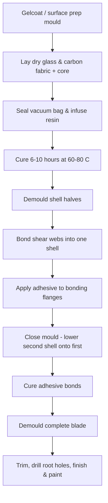

# Wind Turbine Blade Composites

Wind turbine blades are the largest composite structures manufactured in series anywhere in the world. Modern offshore blades reach 115 metres long and weigh 30-35 tonnes each. Onshore blades are typically 60-80 metres. Every one of these blades is a composite part — there is no practical alternative material that combines the stiffness, fatigue resistance, and low weight that composites provide at this scale. This page explains what goes into a blade, why the materials and processes are chosen the way they are, and where the industry is heading.

## Why Composites — And Only Composites

A wind turbine blade must be light enough for the tower and drivetrain to support, stiff enough to avoid striking the tower under extreme gusts, strong enough to survive 20-25 years of continuous cyclic loading, and aerodynamically shaped to capture energy from the wind. No metal meets all four requirements at blade scale. Steel is too heavy. Aluminium fatigues too quickly. Wood cannot be manufactured to the tolerances needed. Composites — specifically glass-fibre reinforced polymers (GFRP) — tick every box.

Blades are also enormous. A single blade for a modern 15 MW offshore turbine is longer than a Boeing 787 wing. Three of them sit on one rotor, spinning at 6-12 rpm for decades. The loads are dominated by gravity (the blade's own weight bends it every revolution) and aerodynamic forces from the wind. This combination of size, weight sensitivity, and fatigue makes composites the only viable material family.

Major blade manufacturers include LM Wind Power (owned by GE Vernova), Siemens Gamesa, Vestas, TPI Composites, Nordex, and Goldwind. Annual global production exceeds 100,000 blades.

## Blade Anatomy

A wind turbine blade is not a solid composite part. It is a hollow, multi-component assembly with distinct structural regions, each optimised for a different job. The cross-section below shows the key elements.

```
Blade cross-section (looking from tip toward root):

                         Leading edge
                            ╱ ╲
                           ╱   ╲
                    ------╱     ╲------
                   ╱   skin      skin   ╲
                  ╱  (sandwich)  (sandwich)╲
                 ╱                          ╲
                |  ┌─────┐        ┌─────┐   |
                |  │spar │  shear │spar │   |
    Suction     |  │cap  │   web  │cap  │   |   Pressure
    side skin   |  │(UD) │(sandw.)│(UD) │   |   side skin
                |  │     │        │     │   |
                |  └─────┘        └─────┘   |
                 ╲                          ╱
                  ╲  (sandwich)  (sandwich)╱
                   ╲   skin      skin   ╱
                    ------╲     ╱------
                           ╲   ╱
                            ╲ ╱
                        Trailing edge
                      (bonded joint)

Key:
  spar cap  = thick unidirectional laminate (carries bending)
  shear web = sandwich panel (carries shear between spar caps)
  skin      = sandwich panel (maintains aerodynamic shape)
```

### Spar Caps

The spar caps are the main load-carrying elements. They run along the length of the blade on both the suction (top) side and the pressure (bottom) side. Think of them as the flanges of an I-beam. When the blade bends under wind load or its own weight, one spar cap goes into tension and the other into compression. They are thick, monolithic (no core), unidirectional (UD) laminates — mostly 0-degree fibres aligned along the blade length. In a large blade, the spar cap at the root can be 60-80 mm thick, tapering to just a few millimetres near the tip.

### Shear Webs

The shear webs connect the two spar caps vertically, like the web of an I-beam. They transfer shear forces and prevent the cross-section from collapsing. Shear webs are typically sandwich panels — biaxial glass-fibre face sheets bonded to a foam or balsa core. Most blades have two shear webs, though some designs use three for added stability in very long blades.

### Aerodynamic Shells

The outer skins give the blade its aerodynamic profile. They carry relatively low in-plane loads but must resist buckling under compression (especially the suction-side skin). They are sandwich panels — thin triaxial glass-fibre face sheets over a foam or balsa core. The core thickness varies along the blade span, thicker where buckling resistance is needed, thinner near the tip where loads are lower.

### Root Section

The blade root is where the composite structure connects to the steel hub via a bolted flange. This is the thickest part of the laminate — sometimes over 100 mm of solid glass fibre. Steel T-bolt inserts or threaded bushings are embedded into the laminate during manufacturing. The root is circular in cross-section (transitioning from circular at the hub to an aerofoil shape over the first few metres). Manufacturing the root is challenging because thick laminates risk exothermic overheating during cure — the heat generated by the curing resin cannot escape from the centre of a very thick layup.

### Leading Edge

The leading edge takes a beating. Rain, hail, insects, sand, and salt erode it continuously. Leading edge erosion (LEE) is one of the largest maintenance costs in wind energy — an eroded leading edge disrupts airflow and can reduce annual energy production by 2-5%. Blades often include erosion-protection systems: polyurethane coatings, thermoplastic shields, or factory-applied tape systems. Some manufacturers bond thermoplastic strips to the leading edge that can be replaced in the field.

### Trailing Edge

The trailing edge is where the suction-side and pressure-side shell halves meet. They are bonded together with structural adhesive. This bonded joint is a common failure location — adhesive bondlines are vulnerable to peel loads, fatigue, and manufacturing defects (voids, inadequate adhesive fill). Trailing-edge cracking is one of the most frequently reported blade defects in service.

## Materials

### Glass Fibre Dominates

Glass fibre — specifically E-glass — makes up 80% or more of a typical blade by weight. The reasons are cost and fatigue performance. E-glass/epoxy laminates have well-characterised fatigue behaviour over billions of cycles, and glass fibre costs roughly 1-3 USD per kilogram versus 15-30 USD per kilogram for carbon. For a structure where blades weigh 20+ tonnes each and turbines are installed by the thousands, cost per kilogram matters enormously.

The most common reinforcement forms are:
- **Unidirectional (UD) fabrics** — for spar caps (0-degree, carrying bending loads)
- **Biaxial fabrics** (+/-45 degrees) — for shear webs and parts of the shells
- **Triaxial fabrics** (0/+45/-45 degrees) — for aerodynamic shells, providing stiffness in multiple directions

### Carbon Fibre Spar Caps

For blades longer than about 60 metres, the weight of a purely glass-fibre spar cap becomes a problem. Carbon fibre is roughly three times stiffer and 40% lighter than glass at the same cross-section, so a carbon spar cap can be thinner and lighter while meeting the same stiffness requirement. Vestas pioneered the use of pultruded carbon-fibre strips in spar caps for their large offshore blades, and several other manufacturers have followed.

There are two main approaches to carbon spar caps:

**Pultruded strips:** Pre-cured carbon-fibre strips (typically 5 mm thick, 100 mm wide, cut to length) are stacked into the mould like planks and then infused with resin to bond them together and to the rest of the blade. The strips arrive with consistent quality from the pultrusion factory. This is the approach Vestas uses at scale.

**Infused UD carbon:** Dry unidirectional carbon fabric is laid up in the mould and infused along with the rest of the blade. This avoids the extra step of buying pultruded strips but requires very careful process control — carbon fabrics have lower permeability than glass, making infusion more difficult, and any misalignment of the 0-degree fibres degrades performance significantly.

| Approach | Pros | Cons |
|---|---|---|
| Pultruded strips | Consistent fibre alignment, reliable quality, easier infusion (gaps between strips aid resin flow) | Higher material cost, strip-to-strip bonding reliance, supply chain dependency |
| Infused UD carbon | Lower material cost, fully integrated with shell infusion | Harder to infuse, higher risk of fibre waviness, more process variability |

### Core Materials

The sandwich panels in the shells and shear webs need a core material. Three options dominate:

- **Balsa wood** — excellent shear strength and stiffness for its weight. Used for decades in blades. Supply is geographically concentrated (mainly Ecuador), and quality varies. Absorbs moisture if the laminate is damaged.
- **PET foam** (polyethylene terephthalate) — made from recycled plastic bottles in some grades. Lower mechanical properties than balsa but consistent quality, no moisture absorption, and good sustainability story. Increasingly popular.
- **SAN foam** (styrene acrylonitrile) — higher performance than PET, widely used in shear webs where shear loads are highest.

Most blades use a mix: balsa in high-load areas, PET or SAN foam elsewhere.

### Adhesive Systems

The two shell halves and the shear webs are bonded together with structural epoxy adhesive paste. These bondlines are critical — a blade is only as strong as its weakest bond. Typical bondline thickness is 5-15 mm. The adhesive must fill gaps, cure reliably in thick sections, and resist fatigue over the blade's lifetime. Common suppliers include Hexion, Huntsman, and Gurit.

## Manufacturing Process

### VARTM / Resin Infusion

The vast majority of wind turbine blades are manufactured using vacuum-assisted resin transfer moulding (VARTM), also called resin infusion (see [resin infusion](../03-manufacturing-processes/resin-infusion-vartm.md) for the general process). Each shell half — suction side and pressure side — is infused separately in its own mould. The shear webs are infused or bonded separately and then positioned inside one shell before the other shell is lowered on top and bonded closed.

A typical blade manufacturing cycle:



Total cycle time from empty mould to finished blade is typically 48-72 hours for a large blade. The layup phase alone can take 12-24 hours.

### Prepreg Approach

Siemens Gamesa uses a different process called IntegralBlade technology. Instead of infusing two shell halves separately and bonding them, they lay pre-impregnated (prepreg) glass fabrics around an inflatable bladder, close the mould, inflate the bladder, and cure the entire blade in one shot. The bladder pressure consolidates the laminate from the inside. This eliminates the adhesive bondlines at the leading and trailing edges — a significant reliability improvement since bondline failure is a common defect in conventionally manufactured blades.

The trade-off: prepreg material is more expensive than dry fabric plus infused resin, and the tooling is more complex. But the elimination of bondlines and improved laminate quality can justify the cost for high-volume production.

### Quality Challenges at Scale

Manufacturing an 80-100 metre composite part in a factory environment (not a cleanroom) presents challenges that do not exist at smaller scales:

- **Dry spots** — areas where resin fails to fully wet out the fabric during infusion. In an 80-metre infusion, the flow path is enormous and even small errors in flow media placement or vacuum integrity can leave dry patches.
- **Fibre waviness** — especially in thick spar caps, fabric layers can develop waves or wrinkles during layup. Even a few degrees of misalignment in a 0-degree spar cap reduces compressive strength dramatically.
- **Bondline defects** — insufficient adhesive, voids in the adhesive, or poor surface preparation before bonding. The trailing edge and shear-web-to-spar-cap bonds are the most critical and the hardest to inspect after closure.
- **Exothermic events** — the root section laminate can be over 100 mm thick. If cure temperature is not managed carefully, the exothermic heat from the curing resin can cause thermal runaway, degrading the laminate.

## Design Challenges

### Fatigue

A wind turbine blade experiences roughly 100 million (10^8) load cycles over a 20-year service life — far more than most aerospace structures. Every rotor revolution applies a gravity-driven bending cycle. Turbulent wind adds high-frequency loading on top. Glass-fibre composites have relatively steep S-N curves (stress vs. number of cycles to failure), meaning the allowable stress at 10^8 cycles is much lower than the static strength — often only 20-30% of the ultimate tensile strength. Blade designers must work with these fatigue-reduced allowables, which drives laminate thicknesses up and makes accurate fatigue data essential. You can explore laminate failure envelopes with [AddStack — free laminate calculator](https://addstack.addcomposites.com).

### Lightning Strike Protection

Wind turbines are tall, exposed structures — they get struck by lightning frequently. A lightning strike on an unprotected composite blade can cause explosive damage: the electrical discharge vaporises moisture inside the laminate, creating internal pressure that blows the structure apart. All modern blades include a lightning protection system (LPS): a metal receptor at the tip connected to a copper down-conductor running inside the blade to the root, where it grounds to the hub.

Carbon-fibre spar caps add a complication. Carbon is electrically conductive (unlike glass), so lightning current can flow through the spar cap in unpredictable paths, causing damage away from the intended conductor route. Blades with carbon spar caps need additional electrical bonding and isolation strategies to manage this risk.

### Leading Edge Erosion

A blade tip moves at speeds up to 300 km/h (about 80 m/s). At those speeds, rain drops, hail, insects, and airborne particles erode the leading edge coating and eventually the composite laminate itself. Leading edge erosion degrades aerodynamic performance and is one of the top maintenance costs in wind farm operation. Protection strategies include factory-applied polyurethane coatings, field-applied tape or shield systems, and periodic re-coating using rope-access technicians or drones.

### Blade-Tower Clearance

When a long, flexible blade bends under wind load, its tip can approach the tower. If a blade strikes the tower, the result is catastrophic. This means blade design is often stiffness-driven rather than strength-driven — the laminate must be thick and stiff enough to limit tip deflection to a safe clearance, even though the stress levels may be well within material strength limits. The spar cap, as the primary stiffness element, is sized largely by this deflection constraint.

### Scaling Laws

Blade weight scales roughly with the cube of blade length if you simply scale up the geometry. Double the blade length and — without design changes — the weight increases by a factor of eight. This is why longer blades require innovation: carbon spar caps, optimised core placement, thinner shells, and advanced structural topologies. Engineers cannot simply build a bigger version of what worked at 40 metres and expect it to work at 100 metres.

## Cost Structure

A blade typically represents 20-25% of the total cost of a wind turbine. For a modern onshore turbine, blade costs run roughly 10-15 USD per kilogram of finished blade. An offshore blade using carbon spar caps can run 20-30 USD per kilogram due to the carbon-fibre premium.

The main cost drivers are:
- **Materials** (glass/carbon fibre, resin, core, adhesive) — roughly 50-60% of blade cost
- **Labour** (layup, infusion, bonding, finishing) — roughly 25-30%
- **Tooling** (moulds cost 1-3 million USD each, with a finite number of blade cycles) — roughly 5-10%
- **Transport** (moving an 80-metre blade by road is expensive and sometimes impossible) — remainder

Material costs dominate. This is a key reason glass fibre is preferred over carbon wherever possible — every dollar per kilogram of fibre cost multiplies across tens of tonnes of material per blade and thousands of blades per year.

## Sustainability and Recycling

The wind energy industry faces a growing blade recycling challenge. First-generation blades installed in the 1990s and early 2000s are reaching end of life. Glass-fibre/epoxy composites are thermoset materials — once cured, the resin cannot be melted and reshaped. This makes recycling difficult.

Current end-of-life options:
- **Cement kiln co-processing** — blades are shredded and fed into cement kilns, where the glass fibre replaces some raw material and the resin provides fuel energy. This is the most scaled approach currently.
- **Mechanical grinding** — blades are ground into filler material for concrete or other applications. Low value but diverts from landfill.
- **Pyrolysis / solvolysis** — chemical or thermal breakdown of the resin to recover fibres. Still largely at pilot scale for blade-scale waste.

The most promising long-term solution is thermoplastic resin blades. Unlike thermoset epoxy, thermoplastic resins (such as Arkema's Elium acrylic resin) can be heated and re-melted after cure, allowing the blade to be broken down and the materials separated and recycled. Several demonstration blades have been manufactured using Elium resin with standard VARTM infusion processes. Full commercial adoption is still years away but is the subject of active industry investment.

## Future Trends

### Longer Blades

Offshore turbines continue to grow. Blades of 115 metres are in production, and designs for 120 metres and beyond are in development. Each incremental increase in length requires stiffer spar caps, more advanced materials, and better manufacturing precision.

### Segmented Blades

Transporting a 100-metre blade in one piece by road is impractical or impossible in most geographies. Segmented blade designs split the blade into two or three sections that are manufactured separately and joined on site. GE Vernova and other manufacturers have demonstrated segmented blade concepts. The engineering challenge is the joint — it must carry full structural loads, survive fatigue, and add minimal weight.

### Thermoplastic Composites

Beyond recyclability, thermoplastic resins offer the possibility of welding blade sections together (instead of adhesive bonding) and faster manufacturing cycles. The Elium-based demonstrator blades have proven the concept. Scaling to 80+ metre production blades and qualifying the fatigue performance of thermoplastic laminates is the current focus area.

### Automated Manufacturing

Layup of large blades is still heavily manual. Automated tape laying and fibre placement machines (see [AFP/ATL](../03-manufacturing-processes/afp-atl.md)) are being adapted for blade manufacturing to reduce labour, improve consistency, and cut cycle times. The challenge is that blade moulds are very large and have complex curvature, which pushes the limits of current automation equipment.

## Key Takeaways

- Wind turbine blades are the largest serial-production composite structures in the world, reaching 115 metres and 35 tonnes, built almost entirely from glass-fibre/epoxy composites.
- The blade is a hollow multi-component assembly: spar caps carry bending loads with unidirectional fibre, shear webs transfer shear via sandwich panels, and aerodynamic shells maintain shape with sandwich construction.
- Carbon-fibre spar caps (especially pultruded strips) enable longer, lighter blades but add cost, lightning-protection complexity, and supply-chain dependency.
- VARTM/resin infusion is the dominant manufacturing process, with each shell half infused in a single shot and then bonded together — a cycle of 48-72 hours per blade.
- Fatigue (10^8 cycles over 20 years), leading edge erosion, and lightning strike are the three design challenges that most differentiate blade engineering from other composite applications.
- Blade recycling is an unsolved industry challenge; thermoplastic resins like Arkema Elium represent the most promising path to fully recyclable blades.

## Further Reading / Tools

- [AddStack — free laminate calculator](https://addstack.addcomposites.com) for exploring spar cap and shell laminate designs
- [Fibre Types](../01-fundamentals/fibre-types.md) — carbon vs. glass properties and selection
- [Resin Infusion / VARTM](../03-manufacturing-processes/resin-infusion-vartm.md) — the dominant blade manufacturing process
- [Sandwich Structures](../04-structural-analysis/sandwich-structures.md) — core materials and face-sheet design principles used in shells and shear webs
- [Pultrusion](../03-manufacturing-processes/pultrusion.md) — how pultruded carbon strips for spar caps are manufactured
- [Material Costs](../08-cost-estimation/material-costs.md) — cost comparisons between glass, carbon, and core materials
